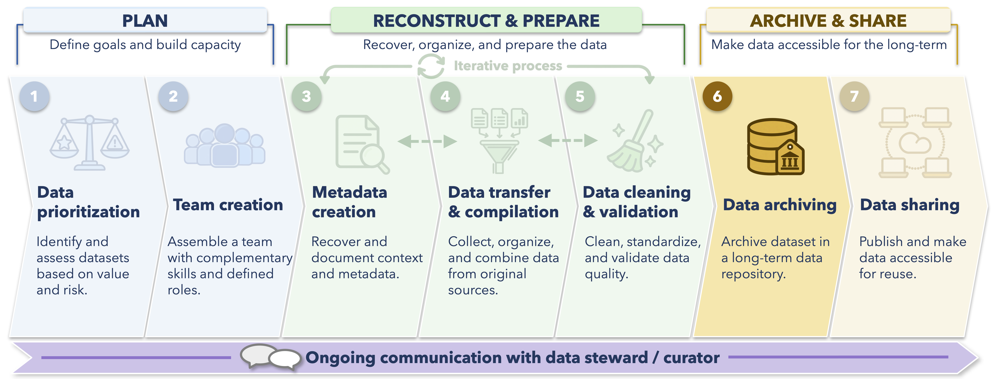

Now that we've cleaned and validated the data, the rescued data still need to be packaged with enough documentation to understand and reuse them, reviewed by the data owner, and deposited somewhere that can preserve them over the long term.

This final stage brings together much of the work completed in the previous chapters. For our example, we will distinguish between two related products: a **primary data archive** containing the cleaned data and documentation needed to understand and reuse them, and a **reproducibility archive** containing the original source files and scripts used to produce the cleaned data.

By the end of this chapter, you should be able to:

- Identify the requirements of a repository before preparing a final archive package
- Decide which data and documentation should be included in the primary data archive
- Determine which source materials and scripts should be preserved separately for reproducibility
- Prepare metadata for entry into a repository
- Consider licensing, access, and sensitivity before publication
- Prepare a complete package for data owner review and upload
- Check the published archive to confirm that the deposit worked as intended

<br>

## Archiving in the data rescue workflow

The diagram below situates this chapter within the broader data rescue workflow.

This chapter focuses primarily on **Step 6: Data Archiving**.
A successful archive also prepares the dataset for Step 7, Data Sharing, by making the data discoverable, documented, and available under appropriate access conditions.

{width="100%" fig-align="center"}

Archiving is something we began thinking about at the beginning of the project. The intended repository can influence file formats, required metadata, documentation, licensing, and the file structure of the final data package.

<br>

## Choosing an archive for the Dirty Data Duck Observatory

For the Dirty Data Duck Observatory, we will use **[Borealis: The Canadian Dataverse Repository](https://borealisdata.ca/)**.

Borealis is a multidisciplinary Canadian research data repository.
Unlike a domain specific repository such as DataStream, it does not require our bird observations to conform to a particular disciplinary data schema before deposit.

Because of this flexibility, the Dirty Data Duck Observatory dataset can retain the original file structure we developed during cleaning:

```text
sites.csv
surveys.csv
bird_counts.csv
```

These tables represent different entities and are connected using documented shared identifier columns. Because Borealis can preserve multiple related files, there is no need to collapse them into one large CSV simply for archiving.

In the previous chapter on [Preparing Data](prepare-data.qmd), we demonstrated how these tables can be joined into a larger working table. That can still be useful for data exploration, validation, and analysis, but the joined table does not need to replace the clearer relational structure of the archived dataset.

::: {.callout-tip}
### Choose a repository before finalizing the archive

Repository requirements can differ substantially.

A general repository such as Borealis can preserve a project specific set of related files and documentation.
A domain repository may instead require data to be mapped to a particular schema, vocabulary, or file structure.

For example, a bird monitoring dataset prepared for a domain repository such as NatureCounts may need to conform to a standardized biodiversity data structure, while a general repository such as Borealis can preserve the project's existing relational tables and documentation.

Your postdoc and Data Rescue team members will have identified a target repository for your project, and it will be helpful to get familiar with the requirements of the intended repository prior to diving into the data itself.
:::

<br>

## Decide what belongs in the primary data archive

An archive should contain enough information for someone outside the original research team to understand what the data represent, how the files relate to one another, and what happened to the data during rescue.

At the same time, depositing every temporary file created during the project is usually not useful.

For the Dirty Data Duck Observatory, our Borealis package might contain a structure like the following:

```text
dirty-data-duck-archive/
│
├── README.txt
│
├── data/
│   ├── sites.csv
│   ├── surveys.csv
│   └── bird_counts.csv
│
├── metadata/
│   └── data_dictionary.csv
│
└── documentation/
    └── change_log.csv
```

The three CSV files are the primary cleaned data products, while the remaining files provide the context needed to interpret and reuse them.

| File | Purpose |
|---|---|
| `README.txt` | Introduces the dataset, describes the files, explains how they relate, and links to the reproducibility archive |
| `sites.csv` | Describes survey locations |
| `surveys.csv` | Describes individual survey events |
| `bird_counts.csv` | Contains bird observations associated with surveys |
| `data_dictionary.csv` | Defines variables, codes, units, and important interpretation details |
| `change_log.csv` | Records important cleaning and interpretation decisions |

Other projects may require additional documentation, maps, protocols, photographs, or other supporting materials. Check whether or not your target repository would accept these additional types of files.

::: {.callout-note}
### What about the original source files and processing scripts?

Original source files should be preserved somewhere as part of the provenance of a rescue project, but they do not necessarily need to be included alongside the cleaned data in the primary data repository.

One useful approach is to maintain the source files, processing scripts, a separate README, and other reproducibility materials in a separate version controlled repository (such as GitHub). That repository can then be archived through a service such as Zenodo to create a persistent record and DOI.

For example, the reproducibility materials for the Dirty Data Duck Observatory might contain:

```text
dirty-data-duck-reproducibility/
│
├── README.md
│
├── data_raw/
│   └── original source files
│
├── scripts/
│   └── prepare-data.R
│
├── metadata/
│   └── supporting metadata and lookup tables
│
└── documentation/
    └── supporting processing documentation
```

This helps create a clear separation between the **cleaned data products intended for reuse** and the **source materials and workflow needed to reproduce them**.

The Borealis record should link to the archived reproducibility record (e.g., in the README file) so that users can trace the cleaned data back to the source material and processing workflow. Once the Borealis dataset is published, its DOI can also be added to the current GitHub README and, where appropriate, to the metadata associated with the archived reproducibility record.

Before making source files publicly available, confirm that the data owner has permission to redistribute them and that they do not contain sensitive, confidential, or otherwise restricted information. If source files cannot be shared publicly, their preservation location and any access restrictions can still be documented.

The exact arrangement will vary among projects, but the important goal is to preserve a traceable path from the original source material to the final archived dataset. Ask clarifying questions about this plan with your postdoc and data rescue team! 
:::

<br>

## Preserve the relational structure

In the previous chapter, we temporarily joined tables to validate their relationships and demonstrate how information could be connected across the dataset.

That joined table was useful during cleaning, but it does not need to become another archived data product. For the final Dirty Data Duck Observatory archive, we will preserve:

```text
sites
  │
  └── site_id
        ↓
surveys
  │
  └── survey_id
        ↓
bird_counts
```

The README and data dictionary should make these relationships explicit.

For example:

| Table | Key | Relationship |
|---|---|---|
| `sites` | `site_id` | One site can be associated with many surveys |
| `surveys` | `survey_id` | Each survey occurs at one site and can contain many bird observations |
| `bird_counts` | `survey_id` + `species_code` | Each row represents a species observation associated with a survey |

Preserving this structure avoids unnecessary redundancy and keeps the meaning of each table clear.

Users who want a single flat table can create one by joining the archived tables using these identifiers.

<br>

## Prepare a README

The README file should orient someone who has just encountered the archive and does not yet know how the pieces fit together. While straightforward in theory, writing a good one often requires deliberate effort. Most often, a README is a plain text file that acts as an instruction manual or map by explaining what the data is, how it is organized, and how to interact with it. Users are expected to read through this file closely (hence the name README!).

For the Dirty Data Duck Observatory, the README should include at least:

- Dataset title and a short description
- Temporal and geographic coverage
- Description of each file
- Relationships among the data tables
- Important identifiers or keys
- Summary of data collection methods
- Major changes in methods through time
- Summary of data rescue and processing
- Explanation of important missing value conventions or codes
- Link and citation for the reproducibility archive containing the source files and processing scripts
- Known limitations or unresolved issues
- Contact information
- Citation and licence information once available

Some of this information will overlap with the metadata entered into the Borealis dataset record, but that overlap is actually useful. The metadata in Borealis help people find and understand the dataset at the repository level, while the README helps them work with the archived files after they have discovered it.

::: {.callout-note}
### Write the README for someone who was not part of the project

A README should allow someone who is not at all familiar with the dataset to understand its history and structure. Terms, abbreviations, file relationships, and important decisions that seem obvious to the rescue team may not be obvious several years later to a new user.

For example, we would want to explain that `site_id` links `sites.csv` to `surveys.csv`, rather than assuming that relationship will be obvious from the file names alone. You may also want to include an [**Entity relationship diagram (ERD)**]{.tooltip-term tabindex="0" data-bs-toggle="tooltip" data-bs-title="A visual representation of the structure of a relational database or dataset, showing its tables (entities), the fields or keys they contain, and the relationships that connect the tables."} to show how the tables are related. Talk with your postdoc and data rescue team about this option.

Similarly, if the bird survey method changed from transects to point counts in 2005, note that explicitly rather than expecting a future user to infer the change from values in the `survey_method` column.

Small pieces of context like these can make the difference between a dataset that is technically available and one that is actually understandable to future users.
:::

<br>

## Finalize the data dictionary

The draft data dictionary developed during metadata preparation should now reflect the final archived files. For each field / column, a new user should know what the field represents and, where relevant, its units, allowed values, codes, relevant methodologies, and missing value conventions.

For example:

| Table | Variable | Description | Type / values | Notes |
|---|---|---|---|---|
| `sites` | `site_id` | Unique identifier for a survey location | Character | Links sites to `surveys` |
| `sites` | `habitat` | Broad habitat classification | Character | Wetland, forest, shoreline, etc. |
| `surveys` | `survey_id` | Unique identifier for a survey event | Character | Links surveys to `bird_counts` |
| `surveys` | `survey_date` | Date on which the survey occurred | `YYYY-MM-DD` | ISO 8601 format |
| `surveys` | `survey_method` | Bird survey method | Transect or Point count | Method changed in 2005 |
| `surveys` | `effort_minutes` | Duration of the survey | Minutes | Early values reconstructed from historical protocol where documented |
| `bird_counts` | `species_code` | Species code used to identify the taxon | Character | Historical codes documented where applicable |
| `bird_counts` | `species_name` | Standardized species name | Character | Historical terminology is documented in the rescue materials |
| `bird_counts` | `count` | Number of individuals observed | Integer | Zero represents no individuals observed; missing values represent unknown information |

The data dictionary should describe the **final archived variables**, not temporary columns created only during cleaning.

<br>

## Prepare the repository metadata

The metadata stored with the repository record are different from the files deposited inside it. These fields allow the repository and other discovery systems to describe, index, search, and cite the dataset.

For Borealis, the core citation metadata include fields such as the dataset title, author, contact, description, and subject.
Additional fields can improve discovery and provide important context, and we will generally aim to also fill these out fields as completely as possible. Much of this information should already exist because we began preparing metadata before cleaning the data.

For the Dirty Data Duck Observatory, our deposit worksheet might include:

| Repository field | Draft information |
|---|---|
| **Title** | Long term breeding season bird surveys at the Dirty Data Duck Observatory, 1998–2024 |
| **Author / creator** | Data owners and other appropriate dataset creators |
| **Affiliation** | Institutional affiliations of the creators |
| **ORCID** | ORCID identifiers where available |
| **Contact** | Person or group responsible for questions about the dataset |
| **Description** | Description of the monitoring program, dataset contents, geographic and temporal scope, and major methodological changes |
| **Subject** | Earth and Environmental Sciences and/or other appropriate repository subject |
| **Keywords** | Bird monitoring, breeding birds, point counts, transects, long term monitoring |
| **Time period covered** | 1998–2024 |
| **Geographic coverage** | Description of the Dirty Data Duck Observatory study area |
| **Methods** | Summary of transect and point count methods and documented protocol changes |
| **Data processing** | Summary of data rescue, cleaning, standardization, validation, and restructuring |
| **Related materials** | DOI and link for the reproducibility archive, along with relevant reports, publications, protocols, or related datasets |
| **Funding information** | Funding agency and award information where appropriate |
| **Licence** | Licence selected by the data owner |
| **Access conditions** | Public, restricted, embargoed, or other conditions as appropriate |

The exact fields available or required may differ among Borealis institutional collections.
Before deposit, check the requirements of the specific collection being used.

::: {.callout-tip}
### Archiving should reuse metadata, not recreate it

If metadata preparation has happened throughout the rescue process, preparing repository metadata should mostly involve **translating information we already have into the fields required by the repository**.

If we reach the archive stage and have to reconstruct the methods, dates, variable meanings, or processing history from scratch, important documentation was probably left out.
:::

<br>

## Decide on licence and access conditions

Before publication, the data owner must decide how the archived data can be accessed and reused.

For a dataset that can be shared openly, this includes selecting an appropriate licence.
The [Repositories and Persistent Identifiers](repositories-doi.qmd) chapter discusses licensing and repository access conditions in more detail.

Not every dataset should automatically be made fully public, and your data rescue team will have developed a plan for this in advance of the archiving stage. Discuss this with your postdoc and team if it is not clear what that plan is.

Before upload, your team will consider whether the files contain:

- Personal or confidential information
- Sensitive ecological locations
- Species locations that should not be publicly disclosed
- Indigenous data subject to governance or sovereignty considerations
- Third party data that the owner does not have permission to redistribute
- Contractual, ethical, or legal restrictions

For bird data, precise locations of sensitive species are one example that may require additional consideration. These questions apply to both the primary data archive and the reproducibility archive. In some projects, the cleaned data may be appropriate for public sharing while the original source files contain information that cannot be redistributed openly.

The rescue team should identify and document potential concerns, but decisions about access, licensing, and publication should be made with the data owner and, where appropriate, the relevant organization or repository staff.

Borealis supports mechanisms such as restricted or embargoed files when open publication is not appropriate.

<br>

## Review the complete package with the data owner

Before anything is published, the data owner should review the package as a whole. This is different from reviewing individual cleaning decisions during the project. Levels of interest in knowing the complete details of data cleaning will differ substantially among data owners.

A final review can confirm:

| Review area | Questions to ask |
|---|---|
| Data | Are the correct final data files included? |
| Relationships | Are the connections among tables clearly documented? |
| Metadata | Are the title, description, methods, dates, locations, and creators accurate? |
| Documentation | Do the README and data dictionary provide enough information for another person to use the data? |
| Processing | Are important cleaning and rescue decisions documented? |
| Reproducibility | Are the source files and processing scripts preserved appropriately, and does the primary archive link to the reproducibility archive? |
| Credit | Are the appropriate creators, contributors, organizations, and funders represented? |
| Licence | Has the data owner approved the proposed licence? |
| Access | Have sensitivity, privacy, and other access concerns been resolved for both archives? |
| Completeness | Are any important files or pieces of context still missing? |

This is also a useful point for the data owner to confirm that any remaining uncertainties are represented honestly in the documentation.

<br>

## Prepare the materials for upload and archiving

For Living Data Project rescue projects, the student team will generally prepare the final materials rather than publishing them directly.

In addition to the completed repository metadata worksheet and any notes about licensing, access, or unresolved questions, the data owner will now receive:

```text
README.txt

data/
  sites.csv
  surveys.csv
  bird_counts.csv

metadata/
  data_dictionary.csv

documentation/
  change_log.csv
```


The team can also prepare the reproducibility materials separately:

```text
README.md

data_raw/
  original source files

scripts/
  prepare-data.R

metadata/
  supporting metadata and lookup tables

documentation/
  supporting processing documentation
```

Where these materials can be shared publicly, they can be maintained in a version controlled repository such as GitHub and archive to create a persistent reproducibility record. The primary data archive should include the link or DOI for that reproducibility record.

The data owner can then review the material and upload the approved data and documentation files to the appropriate Borealis collection. This handoff is important! Publishing creates a persistent scholarly record, so the final decision about what is released and under what conditions ultimately belongs to the data owner.

<br>

## Upload to Borealis

The exact interface may change over time, and institutional Borealis collections can have somewhat different submission or review procedures.

Rather than treating this chapter as a step by step Borealis interface tutorial, the general deposit process is:

1. Create a dataset record in the appropriate Borealis collection
2. Enter the dataset metadata, including the reproducibility archive under related materials
3. Upload the approved cleaned data and documentation files
4. Select the appropriate licence and access conditions
5. Review the draft dataset
6. Submit the deposit for institutional review or publish it, depending on the collection's workflow

Borealis creates a repository record and persistent identifier for the dataset, allowing it to be cited and found independently of any publication that uses the data.

::: {.callout-important}
### Uploading files is not the same as archiving data

A collection of CSV files uploaded to a repository without documentation may technically be stored there, but it may still be very difficult to understand or reuse.

The archive includes the **data, metadata, documentation, provenance, and context** needed to make those files meaningful over time.

For this example, some of that provenance is preserved in the linked reproducibility archive rather than duplicated in Borealis.
:::

<br>

## Check the published archive

After the dataset is published, inspect the archive as though you were encountering it for the first time.

Confirm that:

- The dataset title, authors, and description appear correctly
- The DOI or other persistent identifier resolves
- All intended files are present
- Files can be downloaded and opened
- The README and data dictionary render or download correctly
- Licence and access conditions appear as intended
- The repository generated citation is accurate
- The reproducibility archive is linked correctly
- Related publications or datasets are linked where appropriate

It is especially useful to download the archived files rather than assuming that the successful upload means everything worked as intended.

The Borealis DOI should also have been added to project documentation, publications, reports, websites, and the current GitHub README for the reproducibility workflow.

Where appropriate, the relationship between the primary data archive and the archived reproducibility record should also be recorded in the metadata for both records.

<br>

## What if something changes later?

An archive should provide a persistent record, but that does not mean mistakes can never be corrected.

Repositories such as Borealis support dataset versioning.
If an error is discovered or documentation needs to be improved, the data owner can create an updated version while preserving the history of the archived dataset.

The same principle applies to the reproducibility archive. If the processing workflow changes in a way that affects the published data, the updated code and any relevant source documentation should also be preserved in a new archived version or release.

This is preferable to quietly replacing files in a way that makes it impossible to determine which version someone previously used.

If an update is made, document:

- What changed
- Why it changed
- Which files were affected
- Whether the scientific interpretation of the dataset changed
- Whether both the primary data archive and reproducibility archive need to be updated

The same principle applies throughout the rescue workflow: preserve the trail back to the source data!

<br>

## What changes with another repository?

The broad workflow remains similar even when the archive changes:

**Check requirements → prepare data → prepare metadata and documentation → review → deposit → verify**

What changes is the repository's expected structure.

| Type of repository | What may change |
|---|---|
| General research repository such as Borealis | Project specific tables and documentation can usually be preserved directly |
| Water quality repository such as DataStream | Data must be mapped to the repository's standardized water quality schema |
| Biodiversity repository | Taxonomic, occurrence, event, or sampling fields may need to follow disciplinary standards |
| Sequence repository | Sequence data, sample metadata, and accession specific requirements may determine the archive structure |
| Government or organizational repository | Required templates, metadata fields, licences, or approval processes may differ |

The relationship between the primary data archive and reproducibility materials may also differ among projects.
Some repositories may accept data, scripts, and source files together, while in other cases it makes more sense to preserve the reproducibility workflow separately and link the records.

<br>

## Before finishing the rescue

By the end of the archiving stage, the project should contain a reviewed and documented dataset that is ready for long-term preservation, along with a clear record of how the cleaned data were produced.

| Project component | What should exist at this point |
|---|---|
| Final data | Cleaned data tables in appropriate, reusable formats |
| README | A clear introduction to the dataset, archived files, and related reproducibility materials |
| Data dictionary | Definitions for the variables, codes, units, and important conventions |
| Change log | Documentation of important rescue and cleaning decisions |
| Reproducibility archive | Source files, scripts, and supporting materials preserved separately where appropriate |
| Repository metadata | Completed descriptive information for the primary archive record |
| Licence and access | Decisions reviewed and approved by the data owner |
| Data owner review | Confirmation that the package accurately represents the dataset |
| Primary data archive | Dataset deposited in an appropriate long term repository |
| Persistent identifiers | DOI or other identifiers used to cite and connect the archived records |

A rescued dataset is most useful when someone who was not involved in the rescue can find it, understand it, determine how it can be reused, and trace how the cleaned data were produced.

That is the point at which the scientific archaeology of data rescue becomes something more durable: a dataset that can reenter the scientific record rather than disappearing back into another folder.

<br>

## References in this chapter

Bledsoe, E. K., Burant, J. B., Higino, G. T., Roche, D. G., Binning, S. A., Finlay, K., Pither, J., Pollock, L. S., Sunday, J. M., & Srivastava, D. S.
(2022).
Data rescue: Saving environmental data from extinction.
*Proceedings of the Royal Society B: Biological Sciences*, *289*(1979), Article 20220938.
<https://doi.org/10.1098/rspb.2022.0938>.

Borealis.
The Canadian Dataverse Repository.
<https://borealisdata.ca/>.

GitHub.
<https://github.com/>.

Zenodo.
<https://zenodo.org/>.