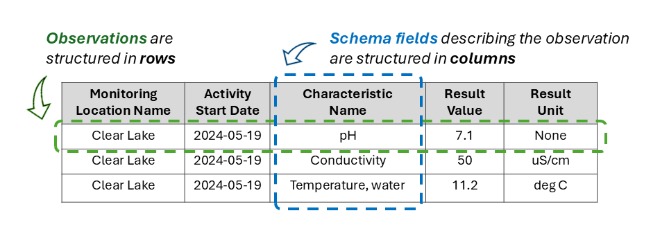
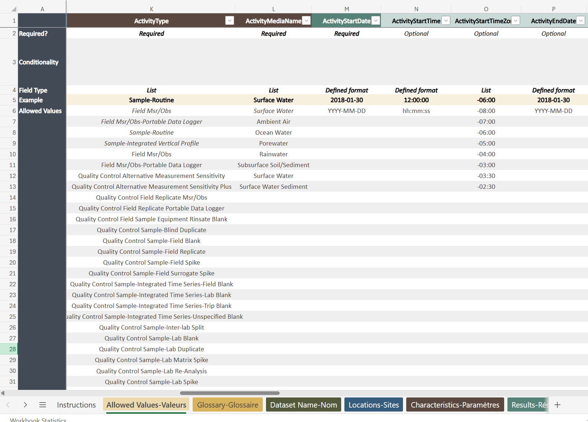

You will upload two different types of information to a chosen digital repository: data (which may consist of a single dataset or multiple datasets) and metadata. This chapter covers **data.**

By the end of this chapter, you should be able to:

-   Recognize when datasets are in wide versus long-format
-   Apply tidy data principles to a dataset
-   Describe a data schema and its purpose

 

## Data Format and Structure

The data you are rescuing will usually be composed of one or more plain-text files, most commonly as a **tab-separated values (.tsv)** file or a **comma-separated values (.csv)** file. These open filed formats are widely supported, easy for software to read, and suitable for long-term preservatin and sharing.

Whenever practical, our goal is to organize rescued data into as few files as possible, and ideally into a single, complete data table. Fewer files make datasets easier to understand, manage, document, and share, while reducing the risk that important information becomes separated or lost over time. In some cases, however, multiple linked tables may be the most appropriate structure.

However, combining the data into a single file often results in a very **wide** data table with many missing (NA) data cells. Therefore, our goal is to store and work with the data in **"long format"** where each row represents an **observation** and each column represents a **variable**.

 

::: {.callout-tip collapse="false"}
#### DataStream Data Structure

In the DataStream data format, each **observation** (monitoring result) is detailed on a separate row. Columns pertain to various **schema fields** which provide key information about a given observation (more on schema fields below). This is a "long-format" structure, in contrast to "wide-format" where each parameter measured might have its own column.

:::

 

## What is tidy data?

Long format data is fundamental to creating **tidy data**, a best practice in data management and the preferred output format for most data rescue projects. The concept of **tidy data** was formalized by statistician Hadley Wickham (2014) and has become the standard for organizing tabular data in modern data science. In a tidy dataset, each **row** represents a single observation, each **column** represents a single variable, and each **cell** contains a single value. Organizing data in tidy format makes datasets easier to understand, combine, validate, analyze, and share, while ensuring they can be readily used with modern data analysis tools and programming languages. Because of these advantages, tidy data is the preferred format for almost all data rescue projects and for submission to most data repositories.

 

::: {.callout-note collapse="\"false"}
#### Check your understanding: Tidy Data

The table below shows counts of aquatic macroinvertebrate taxa from two streams. Is this table considered tidy?

| Site     | Date       | Baetis | Chironomidae | Dytiscidae | Corixidae |
|----------|------------|--------|--------------|------------|-----------|
| Stream A | 2026-06-15 | 24     | 56           | 2          | 8         |
| Stream B | 2026-06-15 | 11     | 34           | 1          | 4         |

-   [ ] Yes
-   [ ] No, because the taxon names are stored as column headers instead of as values in a single "Taxon" variable
-   [ ] No, because each row contains measurements for multiple taxa
-   [ ] It depends on the file format
:::

::: {.callout-note collapse="true"}
#### Click to reveal the answer

Answer: **No--this dataset is not tidy.** The taxon names are stored as column headers instead of as values in a single "Taxon" variable, meaning this dataset is stored in **wide format**, not tidy format. In tidy data, each row represents a single observation, each column represents a single variable, and each cell contains a single value.

Importantly, this does not mean the original table is "incorrect". For example, wide-format community matrices are common in ecology and are required as inputs for many analytical methods. However, tidy data are generally preferred for data rescue because they are easier to validate, combine, share, and transform into other formats.

A tidy version would look like this:

| Site     | Date       | Taxon        | Count |
|----------|------------|--------------|------:|
| Stream A | 2024-06-15 | Baetis       |    24 |
| Stream A | 2024-06-15 | Chironomidae |    56 |
| Stream A | 2024-06-15 | Dytiscidae   |     2 |
| Stream A | 2024-06-15 | Corixidae    |     8 |
| Stream B | 2024-06-15 | Baetis       |    11 |
| Stream B | 2024-06-15 | Chironomidae |    34 |
:::

 

## Not all data has to be tidy...

Although organizing data into a single, tidy table is the preferred approach for most datasets we will encounter, it is important to recognize that other types of data can be naturally organized across multiple files or tables, or in non-tidy formats designed for specific analytical tasks (e.g., inputs to a model). For example, **spatial datasets** often consist of multiple georeferenced layers (e.g., sampling locations, watershed boundaries, or environmental rasters), while **relational databases** intentionally separate information into linked tables (e.g., sites, samples, and observations) to reduce redundancy and improve data integrity. In these cases, the individual files or tables should be clearly documented, linked to one another using **unique identifiers** (e.g., unique site IDs or sample IDs), and accompanied by **metadata** that describes how the components relate to one another.

A detailed discussion of relational databases is beyond the scope of this guide, but they are widely used in ecological and environmental research. Readers interested in learning more can consult introductory resources on spatial data management and relational databases, such as [*Geocomputation with R*](https://r.geocompx.org/) for spatial data and [The Carpentries SQL lessons for relational databases](https://datacarpentry.github.io/sql-ecology-lesson/index.html). We include more guidance on working with spatial data in the Data Rescue Workflow chapter.

 

## Data schemas

While tidy data is a design philosophy for organizing data, a **data schema** is the specific blueprint or structure of a dataset. It defines what information is stored, how it is organized, and the rules that determine what values are allowed. Just like an architectural blueprint describes the layout of a building before it is constructed, a data schema describes the organization of a dataset before it is populated with data.

A data schema typically specifies:

-   The **variables** (columns) in a dataset

-   The **type** of data each variable contains (e.g., text, numbers, dates)

-   The **relationships** between different tables or files

-   Any **constraints** on the data (e.g., unique identifiers or allowable values)

::: callout-note
### Check your understanding: Data Schemas

A data schema defines not only the fields that each observation should contain, but also the rules for what values are allowed in those fields.

Suppose a schema for freshwater data specifies the following rules:

| Field                      |  Required?  | Conditionality                                  | Schema rule                                                                                                                                       |
|------------------|:--------------:|------------------|---------------------|
| `MonitoringLocationName`   |     Yes     | Not conditional                                 | Any text value                                                                                                                                    |
| `ActivityStartDate`        |     Yes     | Not conditional                                 | Must use \`YYYY-MM-DD\` format                                                                                                                    |
| `CharacteristicName`       |     Yes     | Not conditional                                 | Must be one of: `pH`, `Conductivity`, `TemperatureWater`, or `DissolvedOxygen`                                                                    |
| `ResultValue`              | Conditional | Required if `ResultDetectionCondition` is blank | Must be numeric                                                                                                                                   |
| `ResultUnit`               | Conditional | Required if `ResultValue` is populated          | Must match the selected `CharacteristicName`: `pH` = `None`, `Conductivity` = `uS/cm`, `TemperatureWater` = `degC`, or `DissolvedOxygen` = `mg/L` |
| `ResultDetectionCondition` | Conditional | Required if `ResultValue` is blank              | Must be one of: `BelowDetectionLimit`, `NotDetected`, `AboveDetectionLimit`                                                                       |
| `ResultComment`            |  Optional   | Not conditional                                 | Must be text; 0-500 characters                                                                                                                    |

 

Now review the observations below. Which cells would be flagged during data validation?

| `MonitoringLocationName` | `ActivityStartDate` | `CharacteristicName` | `ResultValue` | `ResultUnit`    | `ResultComment`                |
|------------|------------|------------|-----------:|------------|------------|
| Clear Lake               | 2024-05-19          | `pH`                 |           7.1 | `StandardUnits` |                                |
| Clear Lake               | May 19, 2024        | `Conductivity`       |            50 | `uS/cm`         |                                |
| Clear Lake               | 2024-05-19          | `Water Temp`         |          11.2 | `degC`          |                                |
| Clear Lake               | 2024-05-19          | `Dissolved oxygen`   |          -2.3 | `mg/L`          | Borrowed probe from stream lab |
:::

::: {.callout-note collapse="true"}
### Click to reveal the answer

The schema validator would flag several different types of issues:

| **Validation check**      | **Flagged data**                    | **Why it is flagged**                                                                                                       |
|--------------------------|------------------|----------------------------|
| **Data format**           | `May 19, 2024`                      | `ActivityStartDate` must use the `YYYY-MM-DD` format.                                                                       |
| **Controlled vocabulary** | `Water Temp` and `Dissolved oxygen` | `CharacteristicName` must match one of the allowed values. The correct values are `TemperatureWater` and `DissolvedOxygen`. |
| **Controlled units**      | `StandardUnits`                     | `ResultUnit` must match the selected `CharacteristicName`. For `pH` the correct unit is `None`.                             |

But is there anything else that we missed?

**Yes!** A negative value for dissolved oxygen is *not possible*, but this was not flagged. A data schema helps us identify inconsistent formats, non-standard terminology, and mismatches between related fields, *but we still have to perform our own validation checks to confirm that values make logical sense.* See more on this in the Data Rescue Workflow chapter.
:::

 

::: {.callout-tip collapse="false"} 
## DataStream Data Schema
To ensure consistent formatting of water data and to avoid ambiguous or missing information, DataStream developed an observation-level data schema based on the **WQX standard** for the Exchange of Water Quality Data. DataStream's **Upload Template** (image below) is a user-friendly way for data contributors to add and format their data for DataStream's data schema. The **Allowed Values** tab of the Upload Template outlines the data format used by DataStream, including which columns (or fields) are required, optional or conditional, and how the values in each column should be entered.

Look through your own copy of DataStream's Upload Template in [*Excel*](https://datastreamorg.sharepoint.com/:x:/s/Datastream/EaqAljLj8JRGtHSjZxWKPkYBaz1cU53OxE-jlVd5GUBi7g) or [*Google Sheets*](https://docs.google.com/spreadsheets/d/1OwGkUTyVC3tZ9N_we8uX1kpsPejZnSsgcaTjrlGBxoc) and familiarize yourself with the following:

-   The **Allowed Values** tab outlines all schema fields, including which are required,optional or conditional, and how the values for each should be entered (e.g.number, free text, allowed value list). This tab also includes a list of the "allowed values" for each schema field.
-   The **Glossary** tab describes all the schema fields (column names) and provides definitions for many of the allowed value terms.
-   The **CharacteristicName LOOKUP** tab provides a list of all the water quality parameters (characteristics) accepted on DataStream and how they should be entered. You can also see which parameters require additional information (like sample fraction, and method speciation).

{width="769"}

The **WQX schema** was developed by the US Environmental Protection Agency (EPA) and the US Geological Society (USGS) and is an implementation of the ESAR (Environmental Sampling, Analysis and Results) data standard. It was designed to enable multiple monitoring entities to share results in a common format. In the US, the WQX schema is used on the US EPA's Water Quality Portal to share over 340 million water quality data records data from 400 federal, state, tribal and other partners.
:::

 

## Proprietary software

**Proprietary software** is software owned by a company and typically requires a specific application or license to open and edit its native file formats. Common proprietary software you have likely encountered includes the Microsoft Office Suite (Excel, Word, Powerpoint, Access, etc.) or ArcGIS Pro / ArcMap. As a general principle, **we try to avoid using proprietary software** because access to the software cannot be guaranteed in the future. As a primary goal of data rescue is to make data available in perpetuity, data stored in proprietary software is usually not accepted by repositories. Additionally, software like Microsoft Excel can be highly problematic for data management. For example, Excel automatically reformats cell values (e.g., dates), and as a point-and-click application (i.e., a low-code or no-code application), it makes data processing and quality-control steps difficult to reproduce. So while we may use Excel to enter data into digital format (like in a pre-formatted template), once entered the data should be exported as a .csv file for further work.

 
