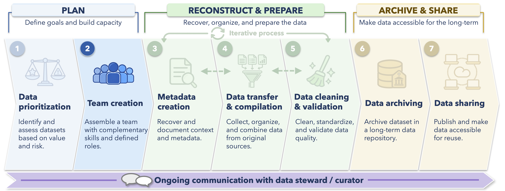

Before cleaning data or filling out metadata, it is worth taking some time to understand what you have received, how the pieces fit together, and what you still need to learn.

Historical datasets rarely arrive as a single tidy table with complete documentation.
You may receive several spreadsheets, reports, field notes, maps, data dictionaries, scripts, or different versions of the same file.
Some parts of the dataset may be easy to interpret, while others depend on context that only the data owner or steward can provide.

The early stages of a data rescue project are therefore about **preserving the source material, becoming familiar with the dataset, and developing a plan for the work ahead**.

By the end of this chapter, you should be able to:

- Preserve the original source files and establish a reproducible project structure
- Inventory and explore the materials provided by the data owner
- Identify the basic structure and relationships among data tables
- Prepare for an initial meeting with the data owner or steward
- Begin tracking questions, decisions, and unresolved issues that will carry forward through the project

<br>

## Where this chapter fits in the data rescue workflow

The diagram below situates this chapter within the broader data rescue workflow used throughout this guidebook.

At this stage, the emphasis is on understanding and organizing the source material before substantial metadata reconstruction, data cleaning, or restructuring begins.

{width="90%" fig-align="center"}

Note that questions uncovered during compilation or cleaning may send you back to the source documentation or to the data owner, while new metadata may change how you interpret or structure the data.

Keeping a clear record of these connections will become increasingly important as the project develops.

<br>

## An example dataset: Dirty Data Duck Observatory bird surveys

Throughout the general data rescue workflow, we will use a small fictional dataset from the **Dirty Data Duck Observatory**, where students and researchers have conducted bird surveys since the late 1990s.

Despite the name, the observatory monitors more than ducks.
The long-term surveys include counts of birds from a range of species across several sites and habitat types.

The observatory would now like to preserve the dataset and make it easier for future researchers to understand and reuse.

The material provided for the project includes:

| File | What it appears to contain |
|------------------------------------|------------------------------------|
| `bird_counts_1998_2024.xlsx` | Bird counts collected during individual surveys |
| `surveys.csv` | Survey dates, observers, methods, and survey effort |
| `sites.csv` | Site IDs, site names, habitat types, and coordinates |
| `species_codes.xlsx` | Bird species names and abbreviations used during surveys |
| `survey_protocols.pdf` | Survey protocols and field instructions from different periods |

An initial look suggests that the dataset is in reasonably good condition, but there are already some questions.
In particular:

- Site IDs are formatted differently in some files.

- Species names and abbreviations are not always consistent.

- Several date formats appear in the bird count spreadsheet.

- One sampling location appears farther from the observatory than expected.

- The survey protocol also seems to have changed at some point during the study.

None of these necessarily represent an error.
At this point, they are things to investigate further.

<br>

## Preserve the source files

Before exploring or cleaning a dataset, preserve an unchanged copy of everything you received.

These files provide the closest thing we have to a starting point for the rescue.
If an interpretation changes later, or a cleaning step produces an unexpected result, the original files allow us to return to the source material and reconstruct what happened.

This idea connects directly to [data provenance](open-science-reproducible-research.qmd).
A reproducible workflow should preserve a trail from the original source material to the final archived dataset.

::: callout-important
### Avoid editing the only copy of a source file

Do not make cleaning changes directly in the only copy of an original spreadsheet or CSV.

Instead, preserve the source file and use a script to create cleaned or transformed versions whenever practical.
If a manual change is unavoidable, document what was changed and why.
:::

A simple project might begin with a structure such as:

``` text
data-rescue-project/
├── data_raw/
├── data_working/
├── metadata/
├── scripts/
├── documentation/
└── outputs/
```

The exact folders are less important than the distinction between **source material** and files created during the rescue process.

Your team may use a somewhat different structure depending on the dataset and the tools introduced in [Some Tools and Best Practices for Reproducible Coding in R](coding-best_practices.qmd).

<br>

## Set up a reproducible project

If R will be used to inspect, clean, or restructure the data, set up the project before substantial work begins.

For our Living Data Project workflows, this will usually mean working within an RStudio Project, using project-relative file paths, and recording the software environment used to process the data.

For example, a new project might initialize `renv` with:

```{r}
#| eval: false
# Initialize a reproducible package environment for the project

renv::init()
```

Once packages have been installed and the workflow begins to stabilize, the package environment can be recorded with:

```{r}
#| eval: false
# Record the package versions currently used by the project

renv::snapshot()
```

Files can then be referenced relative to the project rather than through computer-specific paths.

```{r}
#| eval: false
# Example of a project-relative path

here::here("data_raw", "surveys.csv")
```

The [reproducible coding chapter](coding-best_practices.qmd) covers these practices in more detail.
The important point here is to establish them before the project accumulates many scripts, outputs, and manual processing steps.

<br>

## Inventory what you received

Once the source files have been preserved, take stock of the material before trying to clean it.

A file inventory can be very simple.
Its purpose is to help the team understand what exists, identify obvious gaps or duplication, and record early questions.

For the Dirty Data Duck Observatory example, we might begin with:

| File | Initial interpretation | Questions or concerns |
|------------------------|------------------------|------------------------|
| `bird_counts_1998_2024.xlsx` | Counts of birds observed during surveys | Several worksheets and inconsistent date formats |
| `surveys.csv` | Survey-level information | Some method names appear only after 2008 |
| `sites.csv` | Sampling locations and habitat | One coordinate appears unusually far from the other sites |
| `species_codes.xlsx` | Species names and field codes | Several historical codes have no obvious current match |
| `survey_protocols.pdf` | Survey instructions | Earliest protocol appears to be from 2005 |

This is also a good time to look for multiple versions of apparently similar files.

Names such as:

``` text
bird_counts_final.xlsx
bird_counts_final2.xlsx
bird_counts_FINAL_updated.xlsx
```

should prompt some investigation before any file is treated as authoritative.

File names can provide clues, but they are rarely enough evidence on their own.

### An optional file inventory in R

R can also help summarize the files in a project directory.

```{r}
#| eval: false
# List files in the raw-data folder

fs::dir_info(here::here("data_raw")) |>
  dplyr::select(path, size, modification_time)
```

Modification dates and file sizes can help distinguish versions, but they should be interpreted cautiously.
A newer modification date does not necessarily mean that a file is the most complete or authoritative version.

<br>

## Explore before cleaning

Once you understand what files are available, begin exploring the data.

The goal at this stage is to become familiar with the dataset rather than immediately fix every problem you notice.

Suppose we import the three primary tables from the Dirty Data Duck Observatory.

```{r}
#| eval: false

bird_counts_raw <- readxl::read_excel(
  here::here("data_raw", "bird_counts_1998_2024.xlsx")
)

surveys_raw <- readr::read_csv(
  here::here("data_raw", "surveys.csv"),
  show_col_types = FALSE
)

sites_raw <- readr::read_csv(
  here::here("data_raw", "sites.csv"),
  show_col_types = FALSE
)
```

Some useful first questions are straightforward.

What columns exist?
What does R think their data types are?
How many rows are present?
Which variables contain missing values?
What values occur in categorical fields?
Do numeric variables fall within a plausible range?

A few simple functions can reveal a great deal.

```{r}
#| eval: false

dplyr::glimpse(bird_counts_raw)

summary(bird_counts_raw)

bird_counts_raw |>
  dplyr::count(species_code, sort = TRUE)

surveys_raw |>
  dplyr::count(survey_method, sort = TRUE)
```

Plots can also be useful at this early stage.
A histogram may reveal an unusual count.
A map may show a location far outside the expected study area.
A plot through time may reveal a sudden shift that corresponds to a change in sampling methods.

These are starting points for investigation.

::: callout-note
### Separate detection from correction

It can help to think of data cleaning as two related tasks:

**Detect a potential problem**

Then:

**Decide what, if anything, should be done about it**

The first task can often be automated.
The second may require documentation, outside information, or discussion with the data owner.
:::

<br>

## Understand the structure of the dataset

Many data rescue projects involve more than one table.

Before combining them, determine what a row represents in each table and how the tables relate to one another.

For the Dirty Data Duck Observatory dataset:

| Table | One row represents | Likely identifier |
|------------------------|------------------------|------------------------|
| `sites` | One survey location | `site_id` |
| `surveys` | One survey event | `survey_id` |
| `bird_counts` | One species count within a survey | `survey_id` + `species_code` |

The tables are related, but they contain different kinds of information.

A site may be visited many times.
A survey may include observations of many bird species.
This means that repeatedly storing site coordinates and survey details in every bird-count row would create unnecessary duplication.

Before joining tables, inspect the proposed identifier fields.

For example:

```{r}
#| eval: false
# Check whether survey IDs are unique in the survey table

surveys_raw |>
  dplyr::count(survey_id) |>
  dplyr::filter(n > 1)
```

If this returns records, `survey_id` may not currently function as the unique identifier we expected.

We can also check whether every bird-count record refers to a survey that actually exists.

```{r}
#| eval: false
# Find bird-count records that cannot be matched to the survey table

bird_counts_raw |>
  dplyr::anti_join(
    surveys_raw,
    by = "survey_id"
  )
```

These checks should happen **before** a large join is used to combine data.

A join that unexpectedly duplicates rows can create new errors while appearing to run successfully.

::: callout-tip
### Do all tables need to become one table?

No.

Joining tables can be useful for exploration, validation, analysis, or preparing a particular export.
It does not mean that every dataset should permanently be stored as one large table.

If several related tables represent the data more clearly and reduce unnecessary repetition, preserving that relational structure may be the better choice.
This choice will also depend on the nature of the repository used for archiving.
:::

<br>

## Learn how the dataset came to be

The files themselves aren't likely to contain everything needed to interpret a historical dataset.

Before the first meeting with the data owner or steward, review the available documentation and make a list of what you already understand and what remains uncertain.

For the Dirty Data Duck Observatory dataset, some questions could be answered from the files before contacting anyone.
Others may require knowledge that was never written down.

A useful preparation table might look like this:

| Topic | What we currently understand | What we still need to know |
|------------------------|------------------------|------------------------|
| Purpose | Long-term monitoring of breeding-season bird communities | Whether monitoring objectives changed through time |
| Survey methods | Point counts were used in recent years | What method was used before 2005 and whether effort was comparable |
| Sites | Current site list contains 14 locations | Whether renamed or retired sites existed previously |
| Species codes | Most codes can be interpreted | Meaning of several historical abbreviations |
| Coordinates | Coordinates are available for all current sites | Whether the outlying location is an error or a historical site |
| Data entry | Recent surveys appear to have been entered electronically | How older paper records were transcribed and checked |

Doing this work beforehand makes the conversation with the data owner much more useful.
It also avoids asking questions that could have been answered by reading the material already provided.

<br>

## Meet with the data owner or steward

The first meeting should help establish the history and intended future of the dataset.

For long-running datasets, the data owner / organization may have spent years or decades collecting, organizing, and interpreting the information.
Approach the rescue as a collaborative process, particularly when decisions could affect how the data are represented or shared.

Rather than working through a very long checklist, try to understand a few broad areas during the first conversation.

| Topic | Useful questions |
|------------------------------------|------------------------------------|
| Purpose | Why were the data originally collected? What questions or monitoring goals were they intended to address? |
| History | Did sampling locations, methods, equipment, personnel, or objectives change through time? |
| Source files | Which files should be considered authoritative when versions disagree? |
| Known issues | Are there years, variables, sites, or records that require special interpretation? |
| Future use | How does the data owner hope the rescued dataset will be used? |
| Sharing | Are there ethical, legal, licensing, sensitivity, or ownership concerns that affect publication? |
| Documentation | Are there additional reports, notebooks, codebooks, field sheets, or files that would help interpret the data? |

You do not need to resolve every issue in this meeting, but you will be able to collect more information about the potential challenges with rescuing the dataset.

In most projects, new questions will emerge after the team begins working more closely with the data.

It is therefore useful to establish how future questions should be handled.
Depending on the project, this might involve regular meetings, a shared question log, batched emails, or another agreed system.

<br>

## Start a record of questions and decisions

Even during the first few days of a project, it is easy to forget why a particular question arose or where an interpretation came from.

Start recording these issues early.

At this stage, the record can be quite simple:

| ID | Area | Question or issue | Evidence | Status |
|---------------|---------------|---------------|---------------|---------------|
| Q001 | Survey methods | What survey method was used before 2005? | Earliest available protocol is dated 2005 | Ask data owner |
| Q002 | Species codes | What species does `YRWA` represent in the 1999 file? | Code absent from current species list | Needs review |
| Q003 | Locations | Is the coordinate for site `DDD-07` correct? | Site plots approximately 35 km from other locations | Ask data owner |

Later, some of these questions will become metadata additions, cleaning decisions, or entries in a more formal change log.

The important thing is that the reasoning does not disappear between meetings or become trapped in one team member's memory.

<br>

## Think ahead to the final data product

While you do not need to know the final file structure in the first days of a rescue project, it is still useful to think about where the project is heading.

For example, a repository may require particular metadata fields or file formats.
A partner organization may already have a preferred data platform.
Sensitive information may limit which files can be made public.
A relational dataset may need to remain as several linked tables rather than a single CSV.

The earlier [Repositories and DOIs](repositories-doi.qmd) chapter provides guidance for evaluating possible repositories.

At this stage, the goal is simply to identify any requirements that could affect how the project should be organized.

<br>

## Before moving on

After meeting the project postdoc, data owner / steward, and any other team members, you should have a much clearer picture of both the dataset and the work ahead.

| Project component | What should exist at this point |
|------------------------------------|------------------------------------|
| Source material | An unchanged copy of the files and documentation originally received |
| Project structure | A reproducible workspace with clear locations for source files, scripts, metadata, and outputs |
| File inventory | A basic record of what was received and what each file appears to contain |
| Initial exploration | A preliminary understanding of variables, values, missingness, and obvious inconsistencies |
| Data structure | An understanding of what each table represents and how the tables relate |
| Data-owner context | Initial information about why and how the data were collected and managed |
| Questions | A shared record of unresolved issues and next steps |

You will almost certainly revise some of this understanding as the project continues.

The next chapter focuses on [**Preparing Metadata**](prepare-metadata.qmd), where we begin turning the information gathered here into a more complete description of the dataset and identifying the gaps that need to be resolved before publication.

## R packages used in this chapter

Hester, J., Wickham, H., & Csárdi, G.
(2026).
*fs: Cross-Platform File System Operations Based on 'libuv'*.
R package version 2.1.0.

Müller, K.
(2025).
*here: A Simpler Way to Find Your Files*.
R package version 1.0.2.

Ushey, K., & Wickham, H.
(2026).
*renv: Project Environments*.
R package version 1.2.4.

Wickham, H., Averick, M., Bryan, J., Chang, W., McGowan, L. D., François, R., Grolemund, G., Hayes, A., Henry, L., Hester, J., Kuhn, Max, Pedersen, T. L., Miller, E., Bache, S. M., Müller, K., Ooms, J., Robinson, D., Seidel, D. P., Spinu, V., Takahashi, K., Vaughan, D., Wilke, C., Woo, K., & Yutani, H.
(2019).
Welcome to the tidyverse.
*Journal of Open Source Software*, *4*(43), 1686.
DOI: 10.21105/joss.01686.

## References in this chapter

Bledsoe, E. K., Burant, J. B., Higino, G. T., Roche, D. G., Binning, S. A., Finlay, K., Pither, J., Pollock, L. S., Sunday, J. M., & Srivastava, D. S.
(2022).
Data rescue: Saving environmental data from extinction.
*Proceedings of the Royal Society B: Biological Sciences*, *289*(1979), Article 20220938.
DOI: 10.1098/rspb.2022.0938.
