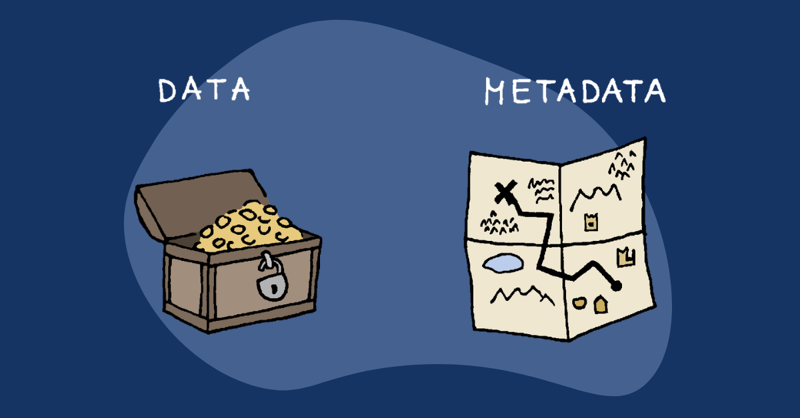

You will upload two different types of information to a chosen digital repository: data (which may consist of a single dataset or multiple datasets) and metadata. This chapter covers **metadata.**

By the end of this chapter (and after reading the Introduction to Data Chapter), you should be able to:

-   Explain the difference between data and metadata
-   Explain how metadata support reproducible research and FAIR principles
-   Recognize the traits of high-quality metadata and identify opportunities to improve existing metadata records
-   Understand how repositories organize and use metadata during data publication

 

## What is metadata?

{fig-alt="Cartoon about data versus metadata with an unlocked box of gold representing data and a map with an X representing metadata." fig-align="left" width="526"}

**Metadata** is a collection of supportive data that provides additional information about a dataset, analogous to a help or README file that accompanies software. As such, the simplest definition of metadata is that it is **"data about data"**, because it provides contextual information about the data that cannot be included or inferred from the data itself. Therefore, metadata often includes information about the **who, what, when, where, why, and how** of a dataset, including:

-   **Who** collected, entered, managed, or processed the data?

-   **What** do the variables, abbreviations, file names, and measurement units mean?

-   **When** were the data collected, processed, and last modified?

-   **Where** were the data collected (e.g., geographic locations, coordinates, study sites, laboratories) and where are related files stored?

-   **Why** were the data collected (e.g., study objectives, hypotheses, or monitoring program)?

-   **How** were the data collected, processed, quality controlled, and organized (e.g. sampling protocols, instruments, assumptions, or processing steps)?

The metadata should provide sufficient information such that (a) anyone can interpret and analyse the data without contacting the authors; (b) anyone in the future could replicate the data collection (e.g., survey or experiment) without requiring further information. As such, **high-quality metadata is a critical component of reproducible research and open science.**

For our purposes, metadata primarily exist at two levels. Some metadata describe the dataset as a whole, such as its purpose, methods, and overall coverage. This is **dataset-level metadata**, which are typically documented in a separate README or metadata record. Other metadata describe individual observations within the dataset, such as when, where, how, and by whom each observation was collected, rather than the whole dataset. This is **observation-level metadata**, which are often stored directly in the data table as variables (columns) or in a separate but linked table.

| | **Dataset-level metadata** | **Observation-level metadata** |
|---|---|---|
| **Describes** | The dataset as a whole | An individual observation or sampling event |
| **Examples** | Dataset title Abstract Study objectives Geographic coverage Temporal coverage Data steward License Citation / DOI | Date and time Location Observer Instrument Laboratory Analytical method Sample ID Detection limit |

 

**Sounds straightforward, right?** Unfortunately, creating high-quality metadata is often one of the most challenging parts of a data rescue project. Unlike the data, metadata often exist in scattered field or lab notebooks, reports, emails, or (quite commonly) in the memories of the original researchers. As a result, documenting metadata often requires careful investigation, synthesis, and occasionally a bit of detective work. Good metadata transform an otherwise uninterpretable collection of files into a reusable scientific dataset, making them one of the most valuable products of any data rescue effort.

 

## FAIR Principles

High-quality metadata does much more than describe a dataset; it helps ensure that the data remain useful long after the rescue project is complete. The **FAIR Principles** provide an internationally recognized framework for making research data easier to discover, understand, and reuse. FAIR stands for **Findable, Accessible, Interoperable, and Reusable**. These principles are a useful guide for creating high-quality metadata, and therefore improve research transparency and reproducibility while supporting long-term preservation and data sharing. Importantly, **FAIR does not necessarily mean open**. Datasets containing sensitive or restricted information can still be FAIR if their metadata clearly describe how the data can be accessed.

 

| Principle     | How metadata helps                                                                                                                                                                                     |
|------------------|------------------------------------------------------|
| Findable      | Includes descriptive titles, keywords, creators, and persistent identifiers (such as DOIs) so datasets can be discovered through repository searches.                                                  |
| Accessible    | Documents how the data can be obtained, including any access restrictions, embargoes, or licensing requirements. Metadata should remain available even if the data themselves cannot be openly shared. |
| Interoperable | Uses standardized formats, controlled vocabularies, and community standards so datasets can be combined with other data and understood by both people and computers.                                   |
| Reusable      | Provides sufficient context---including methods, provenance, documentation, and licensing---for others to correctly interpret and confidently reuse the dataset.                                       |

 

During a data rescue project, you may not be able to make every dataset *perfectly* FAIR. Instead, your goal is to improve the "FAIRness" of the dataset by documenting enough information that future users can discover, understand, and confidently reuse the data. Even small improvements---such as adding a clear title, describing variables, recording units, or measurement techniques---can substantially increase the long-term value of a dataset that is lacking in other information.

 

## Metadata example: Moving toward FAIR data

Let's look at two examples of metadata for a water quality study. The first example below shows metadata that is partially useful but still very much incomplete. 

#### Dataset Title

Water Quality Monitoring Data for Lakes in Southern British Columbia

#### Description

Water chemistry samples collected from 10 lakes in Southern British Columbia over 5 years.

#### Geographic coverage

Southern British Columbia

#### Variables

| Variable | Description              | Units |
|----------|--------------------------|-------|
| Site     | Sampling site            |       |
| Date     | Date collected           |       |
| Temp     | Water temperature        | °C    |
| DO       | Dissolved oxygen         | mg/L  |
| Cond     | Conductivity             |       |
| pH       | Water pH                 |       |
| Observer | Person collecting sample |       |

::: callout-note
#### What is missing?

This metadata provides some context for the dataset, but lacks the detail needed for others to confidently interpret, reuse, or integrate the dataset. As a result, the dataset falls short of several FAIR principles and leaves several important questions unanswered:

**Description:**

-   The description of the data is very brief. Was there a broader purpose to this study? What were the study objectives? Was data collection part of a broader monitoring program?
-   What were the specific methods used to collect and analyze the water chemistry samples? Were there any other organizations / laboratories involved?

**Geographic Coverage**:

-   How is "Southern British Columbia" defined for spatial coverage? Are there specific coordinates that can be used instead?

**Variables**:

-   What naming convention is used for `Site`?
-   Is `Date` written as YYYY-MM-DD, MM/DD/YYYY, or DD/MM/YYYY? Or another format?
-   Was `Temp` measured at the surface, at depth, or averaged across depths?
-   What units are used for `Cond`?
-   Is `Cond` raw conductivity or specific conductivity? This is typically specific conductivity, but is not specified here.
-   Does `Observer` refer to initials, full names, or personnel IDs?

**Missing entirely**:

-   What is the temporal coverage of the dataset?
-   Who can be contacted about this dataset?
-   What citation is appropriate when using this data?
-   Are there any restrictions or licences to know of when using this data?

Without this information, another researcher may struggle to correctly interpret or combine these data with other datasets.
:::

::: {.callout-note collapse="False"}
#### Check your understanding

Which FAIR principles are *particularly* lacking in the above metadata example?

-   [ ] Findability
-   [ ] Accessibility
-   [ ] Interoperability
-   [ ] Reusability
:::

::: {.callout-note collapse="true"}
#### Click to reveal the answer

**Answer:** **Interoperability** and **Reusability** are most lacking because the metadata do not provide enough information for someone outside the original research team to confidently interpret, combine, or reuse the dataset. Important details are missing, including standardized variable names, measurement methods, units, quality assurance procedures, and known limitations.

Although improvements to the metadata would also make the dataset more **Findable** and **Accessible**, the greatest limitations are the lack of contextual information needed to correctly understand and reuse the data. Providing this additional context is one of the primary goals of high-quality metadata and is essential for making datasets FAIR.
:::

 

## Metadata example: Improved metadata

The second metadata example below shows is now improved so that it provides enough detail for another researcher to confidently understand, interpret, and reuse the dataset without contacting the original data collector.

#### Dataset title

Summer Water Quality Monitoring in Mountain Lakes of Southern British Columbia (2018--2022)

#### Description

Water quality measurements were collected during summer field visits between June and September from 2018 to 2022 as part of a monitoring program funded by The BC Lake Stewardship Society, the Watershed Security Fund, the City of Whistler. At each lake, field crews sampled from the approximate deepest accessible point near the lake center when conditions allowed.

Measurements were taken at approximately 0.5 m below the water surface using a calibrated YSI ProDSS multiparameter sonde. Recorded variables included water temperature, dissolved oxygen concentration, pH, and specific conductivity. The sonde was calibrated each morning before sampling according to the manufacturer's instructions. Dissolved oxygen calibration was checked using the water-saturated air method, pH was calibrated using two-point calibration with pH 7 and pH 10 buffers, and conductivity was checked using a certified conductivity standard.

For each sampling event, field crews recorded the site identifier, sample date, observer initials, approximate sampling location, weather conditions, and any deviations from the standard sampling protocol. Measurements were allowed to stabilize before values were recorded. If a probe reading appeared unstable or outside the expected range, the measurement was repeated. Values that remained unusual after repeat measurement were retained in the dataset and flagged in the quality control notes rather than removed.

Spatial coordinates represent the primary sampling location for each lake and are reported as decimal latitude and longitude using the WGS84 coordinate reference system. Dates are recorded using ISO 8601 format: YYYY-MM-DD. Missing values are coded as `NA`.

#### Spatial Extent

Bounding box (WGS84): 
Southwest (Latitude, Longitude): 49.75 -123.30
Northeast (Latitude, Longitude): 50.450 -122.45

#### Temporal Extent

2018-06-01 to 2022-09-31

#### Date published

2024-12-01

#### Data collection organization

University of British Columbia

#### Data steward

Lake Lover (lake.lover\@example.ca)

#### Licence
Public Domain Dedication and Licence (PDDL) v1.0 

This licence places the data in the public domain (waiving all rights). The PDDL imposes no restrictions on your use of the PDDL licensed data. You are free to share, copy, distribute, use, modify, transform, build upon, and produce works from the data. Full legal text: https://opendatacommons.org/licenses/pddl/1.0/  

#### Citation

Lover, L. (2026). Summer Water Quality Monitoring... DOI...

#### Methods

Surface water samples were collected at approximately 0.5 m depth using a calibrated YSI ProDSS multiparameter sonde.

| Variable                      | Description                                                               | Units           | Notes                                               |
|-----------------|----------------------|-----------------|-----------------|
| `site_id`                     | Unique identifier for each sampling location; matches site metadata table | ---             | e.g., `LAKE01`                                      |
| `lake_name`                   | Official or locally used lake name                                        | ---             | Names standardized where possible                   |
| `sample_date`                 | Date of sample collection                                                 | ---             | ISO 8601 format: YYYY-MM-DD                         |
| `latitude_dd`                 | Latitude of primary sampling location                                     | decimal degrees | WGS84                                               |
| `longitude_dd`                | Longitude of primary sampling location                                    | decimal degrees | WGS84                                               |
| `water_temp_c`                | Surface water temperature measured at approximately 0.5 m depth           | °C              | Measured using YSI ProDSS                           |
| `dissolved_oxygen_mg_l`       | Dissolved oxygen concentration measured at approximately 0.5 m depth      | mg/L            |                                                     |
| `specific_conductivity_us_cm` | Specific conductivity corrected to 25°C                                   | µS/cm           | Measured using YSI ProDSS                           |
| `ph`                          | Water pH measured in situ                                                 | pH units        | Measured using YSI ProDSS                           |
| `observer_initials`           | Initials of field technician collecting sample                            | ---             | See personnel metadata for full names               |
| `qc_flag`                     | Quality control flag for the sampling record                              | ---             | `0` = no known issue; `1` = review notes before use |
| `notes`                       | Field or quality control notes relevant to the sampling event             | ---             | Free-text field                                     |

::: callout-note
### How does this metadata support FAIR principles?

The improved metadata describes the dataset at multiple levels. It explains the purpose of the dataset, the spatial and temporal coverage, the methods used to collect measurements, the people or organizations responsible for the data, the license for reuse, known limitations, and the meaning of each variable.

This makes the dataset more aligned with the **FAIR principles**:

-   **Findable:** The title, abstract, geographic coverage, temporal coverage, citation, and DOI make the dataset easier to discover and identify.
-   **Accessible:** The contact information, license, citation, and repository record clarify how the data can be accessed and reused.
-   **Interoperable:** Standardized dates, coordinates, units, variable names, and measurement descriptions make the dataset easier to combine with other freshwater datasets.
-   **Reusable:** Detailed methods, quality control notes, known limitations, and variable descriptions help future users interpret the data responsibly.

Good metadata should allow someone outside the original project to understand what the dataset contains, how it was created, what its limitations are, and how it can be reused.
:::

::: callout-note

### Check your understanding

Which FAIR principle is most directly strengthened by adding detailed methods, quality assurance procedures, and known dataset limitations?

-   [ ] Findable
-   [ ] Accessible
-   [ ] Interoperable
-   [ ] Reusable
:::

::: {.callout-note collapse="true"}
## Answer

**Correct answer:** Reusable.

Detailed methods and quality documentation help future users understand how the data were collected, evaluate their quality, and determine whether the dataset is appropriate for their intended use. These additions are central to making data reusable.
:::

 

## Metadata Standards and Repository Requirements

The examples in this chapter illustrate the types of information that should be included in high-quality metadata, but know that **repositories** typically require metadata to follow a specific format or **metadata standard.** Repositories often organize metadata into a predefined set of fields that ensure datasets are described consistently. As a result, many repositories require contributors to complete an online metadata form or upload metadata using a standardized template before a dataset can be published.

Although every repository has its own metadata requirements, most request similar information, including:

-   Dataset title and abstract
-   Data collection methods
-   Geographic and temporal coverage
-   Data steward or contact information
-   Keywords
-   Licensing and attribution
-   Quality assurance and quality control procedures

::: {.callout-tip collapse="false"}
### DataStream: Dataset-level Metadata

DataStream uses a number of required, optional, or automatically generated fields to create comprehensive dataset-level metadata (table below).

Contributors to DataStream enter their metadata in a standardized format prior to upload by completing this [Metadata form](*https://datastream.org/en-ca/documentation/prepare-metadata*). 

 

| Field                        | Required       | Description                                                                      |
|------------------|------------------|-------------------------------------|
| Dataset Name                 | Yes            | A short self-explanatory title of the dataset.                                   |
| Data Steward Email           | Yes            | Email address publicly associated with the dataset.                              |
| Data Upload Organization     | Yes            | The organization (or researcher) uploading the dataset to DataStream.            |
| Abstract                     | Yes            | A description of the dataset including purpose and nature of monitoring efforts. |
| Data Collection Organization | Yes            | Name of the organization or other parties responsible for collecting the data.   |
| Data Collection Information  | No             | Information about sampling methods, equipment, calibration, and QA/QC protocols. |
| Data Processing              | No             | Description of data cleaning, processing, and QA/QC applied to the data.         |
| Funding Sources              | No             | Funders of the monitoring project.                                               |
| Other Data Sources           | No             | Citations for any third-party datasets included in the dataset.                  |
| Topic Category               | Yes            | ISO 19115 Topic Category.                                                        |
| Keywords                     | No             | Keywords related to the dataset.                                                 |
| Licensing & Attribution      | Yes            | Choose an appropriate open data license.                                         |
| Data Disclaimer              | No             | Additional disclaimer text not covered by the data license.                      |
| Data Source URL              | No             | URL when data are cross-posted from another repository.                          |
| Monitoring Program Progress  | Yes            | Indicates whether monitoring is ongoing or completed.                            |
| Maintenance Frequency        | Yes            | ISO 19115 maintenance frequency indicating expected dataset updates.             |
| Citation                     | Auto-generated | Recommended citation for the dataset.                                            |
| Date Published               | Auto-generated | Date the current version of the dataset was published.                           |
| Date Last Updated            | Auto-generated | Date the dataset was last updated.                                               |
| Version Number               | Auto-generated | Current dataset version.                                                         |
| DOI                          | Auto-generated | Persistent Digital Object Identifier assigned by DataStream.                     |
| Spatial Extent               | Auto-generated | Geographic area covered by the dataset.                                          |
| Vertical Extent              | Auto-generated | Height/depth range represented in the dataset.                                   |
| Temporal Extent              | Auto-generated | Time span covered by the dataset.                                                |

:::

