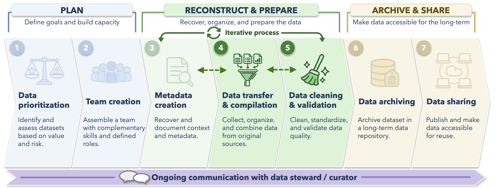

In the previous chapters, we became familiar with the source material, reconstructed important metadata, and began documenting questions and decisions about the bird survey data we received from the Dirty Data Duck Observatory.

Now we can start preparing the data.

For most data rescue projects, this involves bringing source data into a reproducible workflow, resolving formatting and structural problems, standardizing information where appropriate, investigating questionable values, checking relationships among tables, and validating the resulting data.

The specific problems will vary among projects, but many of the same general approaches apply.

By the end of this chapter, you should be able to:

- Apply reproducible cleaning steps to common data cleaning problems
- Distinguish invalid values from unusual values that require further investigation
- Check identifiers and relationships among related tables
- Validate important assumptions before and after cleaning or joining data
- Document cleaning decisions and update metadata when new information emerges
- Export cleaned data without overwriting the source material

<br>

## Data preparation in the data rescue workflow

The diagram below situates this chapter within the broader data rescue workflow. This chapter focuses primarily on **Step 4: Data Transfer & Compilation** and **Step 5: Data Cleaning & Validation**.

{width="100%" fig-align="center"}

Note that these steps are closely connected to the metadata work from the previous chapter.
Cleaning often reveals new questions about methods, codes, locations, missing values, or the structure of the dataset.

When that happens, return to the metadata and change log rather than treating data preparation as a completely separate stage.

::: {.callout-note}
### A general sequence for data cleaning

A data cleaning workflow will rarely proceed perfectly from left to right, but it can help to keep the following sequence in mind:

**Explore → Identify → Clean → Validate → Document → Repeat**
:::

<br>

## Returning to the Dirty Data Duck Observatory

In the previous chapter on [Preparing Metadata](prepare-metadata.qmd), we resolved several questions about the Dirty Data Duck Observatory bird surveys. In particular, historical documentation and conversations with the data owner confirmed that:

- `OWWA` was a historical species code for Ovenbird
- `PC`, `point count`, and `Point count` refer to the same survey method
- Transect surveys were replaced by point counts beginning in 2005
- Surveys before 2003 were designed to last 10 minutes even though effort was not entered in the digital table
- Dates written with slashes use month/day/year
- A bird count of `0` means the species was surveyed for but not observed, while a blank count represents missing or unknown information

We also learned that site `DDD-07` was relocated during the monitoring program. That issue should **not** be solved by simply choosing one set of coordinates and overwriting the other. In this case, the two historical locations and their associated coordinates should be represented explicitly.

For the small working example in this chapter, we will focus on a subset of the data that illustrates several other common cleaning problems.

::: {.callout-note}
### How the code in this chapter is structured

Throughout this chapter, the original `*_raw` tables remain unchanged.

Some objects, such as `survey_method_review`, `count_flags`, and `count_review`, are temporary **review objects** used to explore or diagnose potential problems. They do not become the cleaned dataset.

Once we have enough evidence to make a cleaning decision, we return to the relevant raw table and create a corresponding cleaned table:

- `surveys_raw` → `surveys_clean`
- `bird_counts_raw` → `bird_counts_clean`
- `sites_raw` → `sites_clean`

These cleaned tables will eventually be validated together and exported as the final relational dataset.
:::

<br>

## A small working example

The code chunk below creates three small tables representing the source data we received from the Dirty Data Duck Observatory. It also shows the R packages used to run code thunks throughout the rest of the chapter.

In a real project, these tables would be imported from the preserved source files. We create them directly here so that the examples in this chapter can run without requiring separate downloads.

```{r}
#| code-fold: true
#| code-summary: "Show example data setup and R packages"
#| message: false
#| warning: false

# R packages used in this chapter
# library(tidyverse)
# library(knitr)
# library(here)
# library(renv)
# library(assertr)
# library(sf)

# Site information

sites_raw <- tibble::tribble(
  ~site_id,  ~site_name,       ~latitude, ~longitude, ~habitat,
  "DDD-01",  "Mallard Marsh",     49.272,   -123.183, "Wetland",
  "DDD-02",  "Warbler Woods",     49.261,   -123.201, "Forest",
  "DDD-03",  "Gull Point",        49.284,   -123.167, "Shoreline",
  "DDD07",   "Duck Pond",         49.310,   -123.150, "Wetland"
)

# Survey information

surveys_raw <- tibble::tribble(
  ~survey_id,      ~site_id, ~survey_date,   ~survey_method, ~effort_minutes,
  "DDD-2001-001",  "DDD-01", "05/18/2001",   "Transect",              NA,
  "DDD-2002-002",  "DDD-02", "2002-05-21",   "Transect",              NA,
  "DDD-2005-003",  "DDD-03", "May 19 2005",  "PC",                    10,
  "DDD-2008-004",  "DDD-01", "05/22/2008",   "point count",           10,
  "DDD-2012-005",  "DDD07",  "2012-05-20",   "Point count",           10,
  "DDD-2018-006",  "DDD-02", "05/24/2018",   "Point count",           10,
  "DDD-2020-007",  "DDD-03", "2020-05-25",   "Point count",           10
)

# Bird-count information

bird_counts_raw <- tibble::tribble(
  ~survey_id,      ~species_code, ~species_name,                ~count,
  "DDD-2001-001",  "AMRO",        "American Robin",                  4,
  "DDD-2001-001",  "OWWA",        "Ovenbird",                        3,
  "DDD-2001-001",  "BCCH",        "Black-capped Chickadee",          7,

  "DDD-2002-002",  "AMRO",        "American Robin",                 -2,
  "DDD-2002-002",  "OWWA",        "Ovenbird",                        2,
  "DDD-2002-002",  "BCCH",        "Black-capped Chickadee",          5,

  # Older records use a historical species code and name
  "DDD-2005-003",  "MYWA",        "Myrtle Warbler",                  5,
  "DDD-2005-003",  "AMRO",        "American Robin",                  6,
  "DDD-2005-003",  "BCCH",        "Black-capped Chickadee",          8,

  # Later records use the current species code and name
  "DDD-2008-004",  "YRWA",        "Yellow-rumped Warbler",           6,
  "DDD-2008-004",  "AMRO",        "American Robin",                  8,
  "DDD-2008-004",  "BCCH",        "Black-capped Chickadee",          9,

  "DDD-2012-005",  "MALL",        "Mallard",                        65,
  "DDD-2012-005",  "AMRO",        "American Robin",                  5,
  "DDD-2012-005",  "BCCH",        "Black-capped Chickadee",          6,

  "DDD-2018-006",  "MALL",        "Mallard",                        18,
  "DDD-2018-006",  "AMRO",        "American Robin",                  7,
  "DDD-2018-006",  "BCCH",        "Black-capped Chickadee",         10,

  "DDD-2020-007",  "MALL",        "Mallard",                        24,
  "DDD-2020-007",  "AMRO",        "American Robin",                  9,

  # This survey ID contains a formatting error that will be corrected later
  "DDD-2020-07",   "BCCH",        "Black-capped Chickadee",          2
)

# Species reference table developed during metadata review
# Historical documentation established that MYWA and YRWA should both
# be represented as Yellow-rumped Warbler in the cleaned dataset

species_lookup <- tibble::tribble(
  ~species_code, ~species_name_reference,
  "AMRO",        "American Robin",
  "BCCH",        "Black-capped Chickadee",
  "MALL",        "Mallard",
  "MYWA",        "Yellow-rumped Warbler",
  "OWWA",        "Ovenbird",
  "YRWA",        "Yellow-rumped Warbler"
)
```

These tables contain several issues that we will work through. Some involve formatting, others require information gathered during metadata review, and a few will require us to investigate the data before deciding how we should proceed.

<br>

## Explore before cleaning

Before changing anything, inspect the structure and values in the source tables.

```{r}
#| code-fold: show

dplyr::glimpse(surveys_raw)
```

We can also summarize categorical variables to see what values are actually present.

```{r}
#| code-fold: show

survey_method_review <- surveys_raw |>
  dplyr::count(survey_method, sort = TRUE)

knitr::kable(survey_method_review)
```

The output shows several representations of point counts. Because we already established during metadata review that `PC`, `point count`, and `Point count` refer to the same method, we have evidence to standardize them.

`Transect`, however, represents a genuinely different survey method and should remain distinct.

<br>

## Clean formatting and categorical values

We can now apply several cleaning decisions supported by the metadata.

First, create a small lookup table for survey methods.

```{r}
#| code-fold: show

method_lookup <- tibble::tribble(
  ~survey_method_source, ~survey_method_clean,
  "PC",                  "Point count",
  "point count",         "Point count",
  "Point count",         "Point count",
  "Transect",            "Transect"
)
```

Now we can clean the survey table using the information confirmed during metadata review.

The code chunk below makes four main changes:

- Preserves the original site ID, date, and survey method values in separate `*_source` columns
- Standardizes site IDs so values such as `DDD07` become `DDD-07`
- Converts the different source date formats into a consistent R `Date` field
- Uses the survey method lookup table to standardize equivalent labels such as `PC` and `point count` to `Point count`
- Fills missing `effort_minutes` values before 2003 with `10`, based on the historical protocol confirming that these surveys were fixed at 10 minutes

Notice that these are not all the same kind of cleaning decision.
Some are primarily formatting changes, while others rely on information recovered during metadata review.

```{r}
#| code-fold: show

surveys_clean <- surveys_raw |>

  # Preserve selected original values before creating cleaned versions
  # This makes it easier to trace cleaned values back to the source data
  dplyr::rename(
    site_id_source = site_id,
    survey_date_source = survey_date,
    survey_method_source = survey_method
  ) |>

  dplyr::mutate(
    
    # Standardize the inconsistent site ID
    # Metadata review confirmed that "DDD07" and "DDD-07" refer to the same site
    # All other site IDs are left unchanged
    site_id = dplyr::case_when(
      site_id_source == "DDD07" ~ "DDD-07",
      TRUE ~ site_id_source
    ),

    # Convert the different source date formats into an R Date
    # Metadata review confirmed that slash-formatted dates use month/day/year
    # The source data also contain ISO-standard year-month-day dates
    survey_date = as.Date(
      lubridate::parse_date_time(
        survey_date_source,
        orders = c("mdy", "ymd")
      )
    )
  ) |>

  # Add the standardized survey method value from the lookup table
  # For example, "PC" and "point count" are both mapped to "Point count"
  # "Transect" remains a separate method
  dplyr::left_join(
    method_lookup,
    by = "survey_method_source"
  ) |>

  dplyr::mutate(

    # Reconstruct missing survey effort before 2003
    # Historical protocols confirmed that these surveys lasted 10 minutes
    # Existing effort values and later missing values are left unchanged
    effort_minutes = dplyr::if_else(
      lubridate::year(survey_date) < 2003 &
        is.na(effort_minutes),
      10,
      effort_minutes
    )
  )
```

Let's look at just the fields we changed.

```{r}
#| code-fold: show

surveys_clean |>
  dplyr::select(
    survey_id,
    site_id_source,
    site_id,
    survey_date_source,
    survey_date,
    survey_method_source,
    survey_method_clean,
    effort_minutes
  ) |>
  knitr::kable()
```

This is a useful example of why metadata work comes before many cleaning decisions. We can easily convert `"PC"` to `"Point count"` or replace a missing effort value with `10`, but without metadata review we cannot always determine whether those transformations are justified. That information came from the historical protocols and data owner.

<br>

## Keep source values when they help preserve provenance

Notice that we retained fields such as `survey_date_source`, `site_id_source`, and `survey_method_source`. That was intentional.

During a rescue project, keeping the original and cleaned representations side by side can make the workflow easier to review.

For example:

| Source value | Cleaned value |
|---|---|
| `PC` | `Point count` |
| `point count` | `Point count` |
| `DDD07` | `DDD-07` |

<br>

The final archived dataset may not need every original representation and will likely benefit from a consistent representation.
During cleaning, however, preserving them gives us a clear trail back to the source data.

<br>

## Investigate invalid and unusual values

Now let's look at the bird counts. A plot provides a quick way to identify observations worth investigating.

```{r}
#| code-fold: show
#| fig-width: 8
#| fig-height: 5

# Plot the source bird counts to visually inspect their distributions
# At this stage, we are not applying a statistical outlier rule

ggplot2::ggplot(
  bird_counts_raw,
  ggplot2::aes(
    x = species_code,
    y = count
  )
) +

  # Plot individual observations with slight horizontal jitter
  # so records with similar values remain visible
  ggplot2::geom_jitter(
    width = 0.08,
    height = 0,
    alpha = 0.7,
    size = 2.5
  ) +

  # Mark zero to make logically invalid negative counts easier to see
  ggplot2::geom_hline(
    yintercept = 0,
    linetype = "dashed"
  ) +
  
  ggplot2::labs(
    x = "Species code",
    y = "Bird count"
  ) +

  ggplot2::theme_minimal()
```

Two observations stand out for different reasons.

The American Robin count of `-2` appears to be **invalid** because the number of birds observed cannot be negative.

The Mallard count of `65` appears **unusual**, but it is certainly not impossible. A flock of mallards could produce a legitimate count of that size.

Those two records should therefore not be handled in the same manner.

<br>

### Use rules to flag records for review

We can also formalize our visual inspection in code, as demonstrated in the code chunk below.

Here, negative counts are treated as invalid (we cannot observe negative numbers of birds). We also use [**median absolute deviation (MAD)**]{.tooltip-term tabindex="0" data-bs-toggle="tooltip" data-bs-title="A measure of how far observations typically fall from the dataset's median, calculated using the median of their absolute distances from that median."} (rather than standard deviation) to identify observations that are unusually far from other counts for the same species. Note: Standard deviation is often less useful for identifying outliers because extreme values themselves increase the standard deviation, which can make those same observations appear less unusual.

```{r}
#| code-fold: show

# Review bird counts for two different kinds of problems:
# 1) logically invalid values, such as negative counts
# 2) unusually large or small values that may deserve further investigation

# We calculate these within species because a count that is unusual for one
# species may be completely normal for another

count_review <- bird_counts_raw |>

  # Calculate the screening statistics separately for each species
  dplyr::group_by(species_code) |>

  dplyr::mutate(

    # Calculate the median count for each species
    # The median gives us a typical value to compare each observation against
    species_median = stats::median(
      count,
      na.rm = TRUE
    ),

    # Calculate the median absolute deviation (MAD) for each species
    # MAD summarizes how far observations typically fall from the species median
    # and is useful here because it is less sensitive to extreme observations
    species_mad = stats::mad(
      count,
      na.rm = TRUE
    ),

    # Flag counts that are logically invalid
    # A bird count cannot be negative, so these records require correction
    # or further investigation
    invalid_count = count < 0,

    # Flag counts that are unusually far from the species median
    # Here we define "unusual" as more than 4 MADs from the median
    
    # This is only a screening rule:
    # flagged observations are not automatically treated as errors or removed
    unusual_count = dplyr::if_else(

      # If MAD cannot be calculated, or if all observations are identical
      # and MAD equals zero, do not flag observations using this rule
      is.na(species_mad) | species_mad == 0,

      FALSE,

      # Otherwise, compare the distance from the species median
      # with our chosen threshold of 4 MADs
      abs(count - species_median) > 4 * species_mad
    )
  ) |>

  # Remove the species grouping before continuing
  dplyr::ungroup() |>

  # Keep only records that were flagged as invalid or unusual
  dplyr::filter(
    invalid_count | unusual_count
  ) |>

  # Display only the fields that are useful for reviewing the flagged records
  dplyr::select(
    survey_id,
    species_code,
    species_name,
    count,
    invalid_count,
    unusual_count
  )

# Display the review table in a compact format
knitr::kable(count_review)
```

The negative American Robin count is flagged as invalid because bird counts cannot be less than zero. Notice that it is not flagged as statistically unusual by the MAD-based rule, while the Mallard count value is flagged.

::: {.callout-important}
### An unusual value is not automatically an error

Outlier screening helps identify observations that deserve closer review, but data cleaning decisions are often made with imperfect information.

A flagged value may reflect a transcription error, a real but rare biological event, an undocumented change in sampling, or something that cannot be resolved with certainty. In those cases, the goal is to make the decision best supported by the available evidence.

Before removing, correcting, or retaining an unusual observation, consider the source material, related variables, field notes, sampling context, and input from the data owner when available.

Whatever decision is made, document the rationale, the evidence used, and any remaining uncertainty. Sometimes the most defensible decision is to leave the value unchanged and explicitly note that it was reviewed.
:::

Suppose we return to the source material and find that:

- The original field sheet shows an American Robin count of `2`, confirming that `-2` was a transcription error
- The original field sheet also shows `65` Mallards, with a note describing a large flock on the pond

We therefore have evidence to correct the negative count but to retain the large Mallard count.

<br>

## Use reproducible approaches over hard-coding row or column numbers

Avoid correcting a record based only on where it currently appears in a table.

For example:

```{r}
#| eval: false

bird_counts_raw$count[4] <- 2
```

works only as long as the problematic record remains in row 4.

Instead, identify the record using an approach that works regardless of how rows and columns change. One approach might include the following:

```{r}
#| code-fold: show

bird_counts_clean <- bird_counts_raw |>

  # Rename selected source columns before creating cleaned versions
  # This preserves the original values so we can compare them with
  # any standardized or corrected values later
  dplyr::rename(
    survey_id_source = survey_id,
    species_name_source = species_name,
    count_source = count
  ) |>

  dplyr::mutate(

    # Correct an inconsistent survey ID
    # The source worksheet confirmed that "DDD-2020-07"
    # should refer to survey "DDD-2020-007"
    
    # This rule identifies the record by its value rather than
    # by its row position, so it will still work if the table
    # is reordered or additional rows are added
    survey_id = dplyr::if_else(
      survey_id_source == "DDD-2020-07",
      "DDD-2020-007",
      survey_id_source
    ),

    # Correct the documented negative-count transcription error
    # We use multiple fields to identify the intended record:
    # survey ID, species code, and the original count value
    #
    # The original field sheet showed a count of 2 rather than -2,
    # so this correction is supported by source evidence
    # All other count values are left unchanged
    count = dplyr::case_when(
      survey_id_source == "DDD-2002-002" &
        species_code == "AMRO" &
        count_source == -2 ~ 2,

      TRUE ~ count_source
    )
  ) |>

  # Join the species reference table using species_code
  # This adds the standardized species name associated with each code
  dplyr::left_join(
    species_lookup,
    by = "species_code"
  ) |>

  dplyr::mutate(

    # Use the standardized species name from the reference table
    # when one is available
    #
    # coalesce() returns the first non-missing value, so the original
    # source name is retained if no reference name is available
    species_name = dplyr::coalesce(
      species_name_reference,
      species_name_source
    )
  )
```

This rule identifies the intended observation using meaningful fields (`survey_id`, `species_code`, and the original count value) rather than its row position. That makes the correction more robust if the table is later reordered or expanded.

For many corrections, a separate corrections table may be easier to manage and review than a long series of individual `case_when()` rules.

<br>

## Use reference tables to standardize information

The `species_lookup` table created earlier provides another useful pattern.

Some inconsistencies cannot be resolved confidently from the text in the data alone. Historical datasets may use older species names, locally defined codes, or taxonomic conventions that changed during the life of the monitoring program.

For example, suppose the source data contain both:

```text
MYWA    Myrtle Warbler
YRWA    Yellow-rumped Warbler
```

Historical species lists and documentation from the observatory confirm that these records should be represented using the standardized name Yellow-rumped Warbler in the rescued dataset.

Rather than changing these values individually, a reference table can record how each historical code and name maps to the standardized taxon. This makes the interpretation explicit and allows the same mapping to be applied reproducibly throughout the dataset.

```{r}
#| code-fold: show

bird_counts_clean |>
  dplyr::filter(species_code %in% c("MYWA", "YRWA")) |>
  dplyr::select(
    species_code,
    species_name_source,
    species_name
  ) |>
  knitr::kable()
```

Lookup tables can be particularly useful for:

- Species names and codes
- Site identifiers
- Survey methods
- Gear types
- Habitat classes
- Units
- Observer or organization codes

They also make interpretation decisions easier to review than if those mappings are scattered throughout a long script.

<br>

## Check relationships before joining tables

The Dirty Data Duck Observatory dataset contains several related tables.

| Table | One row represents | Expected key |
|---|---|---|
| `sites` | One survey location | `site_id` |
| `surveys` | One survey event | `survey_id` |
| `bird_counts` | One species record within a survey | `survey_id` + `species_code` |

Before joining these tables, we first need to confirm that the identifiers connecting them behave as expected.

This matters for two reasons.

First, checking relationships among tables is itself an important part of data cleaning and validation. An unmatched `survey_id`, duplicated key, or missing site record may reveal an error or a misunderstanding of the dataset structure.

Second, we may sometimes want to create a **derived flat table** that places survey or site information alongside each bird-count observation. This can be useful for analysis, additional validation, or preparing a particular data export. Before creating that table, however, we need to know that the relationships among the source tables are valid.

For example, `survey_id` should uniquely identify rows in the survey table.

```{r}
#| code-fold: show

duplicate_surveys <- surveys_clean |>
  dplyr::count(survey_id) |>
  dplyr::filter(n > 1)

duplicate_surveys
```

An empty result is useful here: it tells us that no duplicate survey IDs were found.

We can also check whether every bird-count record refers to a survey that exists.

```{r}
#| code-fold: show

unmatched_counts_raw <- bird_counts_raw |>
  dplyr::anti_join(
    surveys_raw,
    by = "survey_id"
  )

knitr::kable(unmatched_counts_raw)
```

The unmatched record in the output points us toward `DDD-2020-07`.

After reviewing the source worksheet, we determined that the intended identifier was `DDD-2020-007`, and that correction is now part of `bird_counts_clean`.

The `anti_join()` function can be particularly useful during data exploration and cleaning because it identifies records that would fail to match when related tables are connected.

<br>

## Standardize the site table

The same site ID rule used in the survey table should also be applied to the site reference table. Applying the same rule in both places ensures that equivalent identifiers are represented consistently before we test or join the relationships among tables.

```{r}
#| code-fold: show

sites_clean <- sites_raw |>

  # Preserve the original site ID before creating a cleaned version
  dplyr::rename(
    site_id_source = site_id
  ) |>

  dplyr::mutate(

    # Standardize the inconsistent site ID
    # Metadata review confirmed that "DDD07" and "DDD-07"
    # refer to the same site
    # All other site IDs are left unchanged
    site_id = dplyr::case_when(
      site_id_source == "DDD07" ~ "DDD-07",
      TRUE ~ site_id_source
    )
  )
```

We can now check whether all surveys refer to recognized sites.

```{r}
#| code-fold: show

surveys_clean |>
  dplyr::anti_join(
    sites_clean,
    by = "site_id"
  )
```

Again, an empty result is what we want to see from the `anti_join()`: every site represented in `surveys_clean` has a corresponding record in `sites_clean`.

<br>

## Create a working joined table

Now that we have checked the relationships among the tables, we can create a **working table** that adds survey information to each bird count record. Having survey date, method, site, and effort alongside each bird observation can support additional data validation and exploration. Additionally, some repositories require a single flat file containing all observation-level data.

Importantly, creating this joined table does **not** mean that the original relational structure is discarded. `sites_clean`, `surveys_clean`, and `bird_counts_clean` remain the primary cleaned tables from which this derived table is generated.

Before joining, record how many bird-count rows exist.

```{r}
#| code-fold: show

n_counts_before <- nrow(bird_counts_clean)
```

Now join the survey information to the bird-count table.

```{r}
#| code-fold: show

bird_counts_with_surveys <- bird_counts_clean |>
  dplyr::left_join(
    surveys_clean,
    by = "survey_id",
    relationship = "many-to-one"
  )
```

The `relationship = "many-to-one"` argument tells `dplyr` what relationship we expect: many bird count records can belong to one survey, but each `survey_id` should correspond to only one record in the survey table.

Making that expectation explicit helps identify a problem if the structure of the data does not behave as expected.

We can also check that the join did not unexpectedly increase or decrease the number of bird count records.

```{r}
#| code-fold: show

stopifnot(
  nrow(bird_counts_with_surveys) == n_counts_before
)
```

Remember that a join that runs successfully is *not necessarily* the correct join. Checking the expected relationship, resulting dimensions, and matches among identifiers can catch problems that might otherwise go unnoticed.

::: {.callout-tip}
### Should the archived dataset be relational or flat?

There is no requirement that every rescued dataset be reduced to one flat table.

For the Dirty Data Duck Observatory, `sites`, `surveys`, and `bird_counts` describe different entities. Preserving them as related tables avoids repeating the same site and survey information across many bird-count records and provides a clear representation of the dataset's underlying structure.

A flat table can still be useful. For example, a repository may require a particular flat file format as part of their data schema. When useful, a flat table can be generated reproducibly from the cleaned relational tables and included as an additional convenience product rather than replacing them.

In the [Archiving and Uploading](archiving-uploading.qmd) chapter, we will consider which data products could be included in the final archive and how the relationships among them should be documented.
:::

## Check spatial information

Coordinates deserve their own validation because many spatial errors still look like perfectly valid numbers. A latitude and longitude can fall within their allowable numeric ranges while still representing the wrong location because of a transcription error, reversed coordinates, an incorrect sign, or an outdated site location.

One useful first step is therefore to **map the locations**. The `sf` package is a very useful tool for this kind of exercise.

```{r}
#| code-fold: show
#| fig-width: 7
#| fig-height: 5

# Convert the site table to an 'sf' object using longitude and latitude
# Keep the original coordinate columns so they remain available for review

sites_sf <- sites_clean |>
  sf::st_as_sf(
    coords = c("longitude", "latitude"),
    crs = 4326,
    remove = FALSE
  )

# Plot the locations as a quick spatial QA/QC check

ggplot2::ggplot(sites_sf) +
  ggplot2::geom_sf(size = 3) +
  ggplot2::geom_sf_text(
    ggplot2::aes(label = site_id),
    nudge_y = 0.002
  ) +
  ggplot2::labs(
    x = "Longitude",
    y = "Latitude"
  ) +
  ggplot2::theme_minimal()
```

A map can reveal problems that are difficult to identify from a table alone. For example, look for:

- A site far outside the expected study area 
- Latitude and longitude that may have been reversed
- An incorrect positive or negative sign
- Multiple sites unexpectedly sharing the same coordinates
- A site whose recorded location changes through time
- Overlap between mapped coordinates and geographic features (e.g., is a sampling site for a lake actually located on the lake?)

As with unusual numerical values, a suspicious coordinate should be **investigated rather than automatically corrected**. Field notes, maps, historical documentation, related records, or information from the data owner may be needed to determine what happened.

A visual check is a great start, but we can also encode geographic expectations in the workflow. Suppose documentation for the Dirty Data Duck Observatory indicates that all survey sites should fall approximately within the following geographic extent:

```{r}
#| code-fold: show

spatial_review <- sites_clean |>
  dplyr::mutate(
    within_expected_extent =
      latitude >= 49.20 &
      latitude <= 49.35 &
      longitude >= -123.30 &
      longitude <= -123.05
  ) |>
  dplyr::filter(!within_expected_extent)

spatial_review
```

An empty result indicates that no sites fall outside the expected geographic extent. That's good!

The appropriate spatial checks will, naturally, depend on the nature of the dataset. For some datasets, a broad geographic extent may be sufficient. In others, we may compare points with a known study area boundary, check whether repeated samples from the same station use consistent coordinates, or investigate documented site relocations.


<br>

## Build validation into the workflow

Cleaning data inherently changes it. Validation code checks whether the outputs are as we expected.

Whenever a cleaning step makes an assumption that can be tested, consider writing that assumption into the script.

For example, after resolving the negative count value for American Robin, no bird counts should be less than zero.

```{r}
#| code-fold: show

stopifnot(
  all(
    bird_counts_clean$count >= 0 |
      is.na(bird_counts_clean$count)
  )
)
```

We can also combine several important checks into a small validation summary.

```{r}
#| code-fold: show

# Use assertr to test several important expectations about the cleaned data
# If any expectation is FALSE, verify() will stop the script and report the failure
# This helps prevent us from continuing with data that do not meet our assumptions

# Check 1: Bird counts should not be negative after cleaning
# Missing counts are allowed, so remove NA values before applying the check
bird_counts_clean |>
  dplyr::filter(!is.na(count)) |>
  assertr::verify(
    all(count >= 0)
  )

# Check 2: Each survey_id should identify only one survey
# count() gives the number of rows associated with each survey ID
# Every value of n should therefore equal 1
surveys_clean |>
  dplyr::count(survey_id) |>
  assertr::verify(
    all(n == 1)
  )

# Check 3: Every bird-count record should match a survey
# anti_join() retains only records that do NOT have a matching survey
# We therefore expect the number of unmatched records to equal zero
bird_counts_clean |>
  dplyr::anti_join(
    surveys_clean,
    by = "survey_id"
  ) |>
  dplyr::summarise(
    n_unmatched = dplyr::n()
  ) |>
  assertr::verify(
    n_unmatched == 0
  )

# Check 4: Every survey should match a recognized site
# Again, an anti_join() should return zero unmatched records
surveys_clean |>
  dplyr::anti_join(
    sites_clean,
    by = "site_id"
  ) |>
  dplyr::summarise(
    n_unmatched = dplyr::n()
  ) |>
  assertr::verify(
    n_unmatched == 0
  )

# Check 5: All sites should fall within the documented study extent
sites_clean |>
  dplyr::filter(
    latitude < 49.20 |
      latitude > 49.35 |
      longitude < -123.30 |
      longitude > -123.05
  ) |>
  dplyr::summarise(
    n_outside_extent = dplyr::n()
  ) |>
  assertr::verify(
    n_outside_extent == 0
  )

# Check 6: Joining survey information onto the bird-count table
# should not accidentally add or remove bird-count records
bird_counts_with_surveys |>
  dplyr::summarise(
    n_rows_after_join = dplyr::n()
  ) |>
  assertr::verify(
    n_rows_after_join == n_counts_before
  )

# If the script reaches this point, all five assertions passed
validation_summary <- tibble::tibble(
  check = c(
    "No negative bird counts",
    "Survey IDs are unique",
    "All bird counts match a survey",
    "All surveys match a site",
    "Join preserved bird-count rows"
  ),
  result = "Passed"
)

knitr::kable(validation_summary)
```

This type of validation is useful because it turns assumptions about the cleaned dataset into explicit tests. Here, `assertr::verify()` checks several expectations about the cleaned data and, by default, stops the script if one of them is not met rather than allowing the workflow to continue with a problem. The final table is therefore produced only if all five validation checks pass. Note that `assertr` provides options for modifying how failed assertions are handled.

Depending on the project, validation could also check:

- Required fields
- Expected date ranges
- Allowed categories
- Logical numeric bounds
- Unique identifiers
- Geographic bounds
- Missing values in fields expected to be complete
- Coordinate ranges and spatial locations  
- Consistency among repeated measurements of the same site or entity

We show `assertr` functions here, but the particular tool matters less than the general principle: **if an important assumption can be checked reproducibly, write the check into the workflow**.

<br>


## Update the metadata when cleaning changes your understanding

Data cleaning frequently reveals information that belongs back in the metadata.

Suppose duplicate checking reveals that some early bird count records contain separate male and female observations that were not described in the existing data dictionary. That means our understanding of what one row represents in the data was likely incomplete.

We would need to revisit the source data, update the data dictionary, determine whether sex should remain an explicit field, reconsider the key for the table, and revise the cleaning workflow.

<br>

## Document important decisions

The change log from the previous chapter should continue to develop during cleaning.

For example:

| ID | Area | Issue or decision | Evidence | Action | Status |
|---|---|---|---|---|---|
| D001 | Survey methods | `PC` and `Point count` represent the same method | Historical protocol and data owner confirmation | Standardize to `Point count` | Resolved |
| D002 | Survey effort | Pre-2003 blank effort values represent fixed 10-minute surveys | Historical protocol | Fill missing effort with 10 minutes | Resolved |
| D003 | Bird counts | American Robin count of `-2` is a transcription error | Original field sheet records `2` | Correct value to `2` | Resolved |
| D004 | Bird counts | Mallard count of `425` is unusually high | Original field sheet confirms large flock | Retain original count | Resolved |
| D005 | Survey ID | `DDD-2020-07` omits a leading zero | Source worksheet links record to `DDD-2020-007` | Standardize identifier | Resolved |

Notice that investigating a questionable value does not always result in changing it. The Mallard record is documented in the change log precisely because we investigated it and decided **not** to change it.

<br>

## Prepare the cleaned data products

After the major cleaning and validation issues have been resolved, create the tables that will move forward into the final data package.

For the Dirty Data Duck Observatory, we will retain the relational structure:

```text
sites.csv
surveys.csv
bird_counts.csv
```

Before exporting, we can select the fields intended for the cleaned versions rather than carrying every temporary working column forward.

```{r}
#| code-fold: show

sites_final <- sites_clean |>
  dplyr::select(
    site_id,
    site_name,
    latitude,
    longitude,
    habitat
  )

surveys_final <- surveys_clean |>
  dplyr::select(
    survey_id,
    site_id,
    survey_date,
    survey_method = survey_method_clean,
    effort_minutes
  )

bird_counts_final <- bird_counts_clean |>
  dplyr::select(
    survey_id,
    species_code,
    species_name,
    count
  )
```

For example, the cleaned survey table now looks like:

```{r}
#| code-fold: show

knitr::kable(surveys_final)
```

The cleaned tables can then be exported as simple, non-proprietary CSV files using UTF-8 encoding. UTF-8 is the most widely used text-encoding standard and is commonly expected by repositories, government agencies, and other organizations because it supports a broad range of characters while remaining highly interoperable across software and operating systems.

```{r}
#| eval: false

# Export the cleaned tables as UTF-8 encoded CSV files
# readr::write_csv uses UTF-8 encoding by default

readr::write_csv(
  sites_final,
  here::here("outputs", "sites.csv")
)

readr::write_csv(
  surveys_final,
  here::here("outputs", "surveys.csv")
)

readr::write_csv(
  bird_counts_final,
  here::here("outputs", "bird_counts.csv")
)
```

The original source files remain **unchanged** and are preserved separately.

<br>

## Rerun the workflow from a clean session

Before treating the outputs as final, restart R and run the processing script from beginning to end. 

The workflow should recreate the cleaned files without depending on objects left over from earlier work, manual edits to intermediate files, or absolute file paths.

If the project uses `renv`, make sure the recorded package environment is up to date:

```{r}
#| eval: false

renv::snapshot()
```

::: {.callout-tip}
### One useful final question

At the end of the cleaning workflow, ask:

> If someone received the source files, scripts, and documentation, could they recreate the cleaned data without asking us what we did?

If not, determine which decisions or processing steps are still missing from the record.
:::

<br>

## What should we have before moving on?

By the end of data preparation, the source data should still be preserved and unchanged, while the project should now contain reproducibly generated cleaned data.

| Project component | What should exist at this point |
|---|---|
| Source data | Preserved and unchanged original files |
| Cleaning workflow | One or more scripts that reproducibly create the cleaned data |
| Cleaned data | Tables with documented formatting, structural, and value issues resolved where possible |
| Table relationships | Checked identifiers, keys, and relationships among related tables |
| Validation | Reproducible checks for important assumptions and expected properties |
| Questionable values | Investigated values retained, corrected, flagged, or removed based on evidence |
| Change log | Documentation of important cleaning decisions and unresolved issues |
| Metadata | Updated documentation reflecting information discovered during cleaning |
| Reproducibility | A workflow that runs successfully from the source files in a fresh R session |

The next chapter focuses on [**Archiving and Uploading**](archiving-uploading.qmd).

There, we will assemble the cleaned data, metadata, scripts, change log, README, and other relevant material into a final data package, review that package with the data owner, and prepare it for long-term preservation in an appropriate repository.


## R packages used in this chapter

Fischetti, T.
(2026).
*assertr: Assertive Programming for R Analysis Pipelines*.
R package version 3.0.1.

Pebesma, E.
(2018).
Simple Features for R: Standardized support for spatial vector data.
*The R Journal*, *10*(1), 439–446.
<https://doi.org/10.32614/RJ-2018-009>.

Müller, K.
(2025).
*here: A Simpler Way to Find Your Files*.
R package version 1.0.2.

Ushey, K., & Wickham, H.
(2026).
*renv: Project Environments*.
R package version 1.2.4.

Wickham, H., Averick, M., Bryan, J., Chang, W., McGowan, L. D., François, R., Grolemund, G., Hayes, A., Henry, L., Hester, J., Kuhn, Max, Pedersen, T. L., Miller, E., Bache, S. M., Müller, K., Ooms, J., Robinson, D., Seidel, D. P., Spinu, V., Takahashi, K., Vaughan, D., Wilke, C., Woo, K., & Yutani, H.
(2019).
Welcome to the tidyverse.
*Journal of Open Source Software*, *4*(43), 1686.
DOI: 10.21105/joss.01686.

Xie, Y.
(2026).
*knitr: A General-Purpose Package for Dynamic Report Generation in R*.
R package version 1.52.4.

## References in this chapter

Bledsoe, E. K., Burant, J. B., Higino, G. T., Roche, D. G., Binning, S. A., Finlay, K., Pither, J., Pollock, L. S., Sunday, J. M., & Srivastava, D. S.
(2022).
Data rescue: Saving environmental data from extinction.
*Proceedings of the Royal Society B: Biological Sciences*, *289*(1979), Article 20220938.
DOI: 10.1098/rspb.2022.0938.