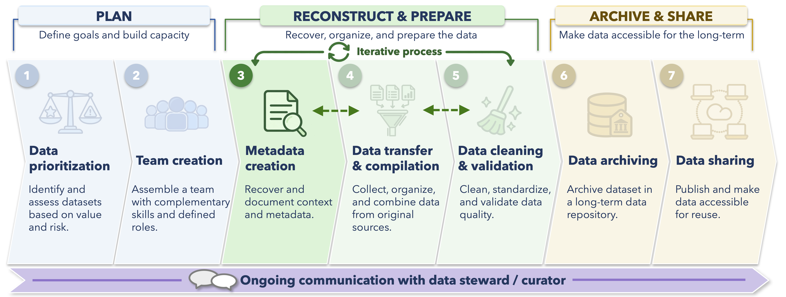

---
title: "Preparing Metadata"
from: markdown+bracketed_spans
editor: 
  markdown: 
    wrap: sentence
---

In the previous chapter, we preserved the original files, created an initial inventory of the material provided by the data owner, explored the structure of the dataset, and began recording questions about its history and interpretation.

Now we can start turning that information into metadata.

As discussed in the [Introduction to Metadata](metadata.qmd) chapter, metadata provide the context needed to understand and reuse a dataset.
In a data rescue project, that context may be scattered across spreadsheets, reports, field notebooks, file names, old protocols, publications, emails, and the memories of people who collected or managed the data.

Preparing metadata therefore involves some reconstruction.
We need to determine what is already documented, identify what is missing or uncertain, and record new information and decisions as they emerge.

By the end of this chapter, you should be able to:

- Identify the major types of metadata needed to understand a dataset
- Create a working record of known, unknown, and uncertain metadata
- Develop or improve a data dictionary
- Use the data themselves to identify metadata questions
- Document metadata decisions, evidence, and unresolved issues
- Work with the data owner to review and improve the metadata

<br>

## Metadata creation in the data rescue workflow

The diagram below situates this chapter within the broader data rescue workflow.

This chapter focuses primarily on **metadata creation**, although updates to the metadata will continue during data cleaning, validation, and publication.

{width="100%" fig-align="center"}

Metadata preparation is rarely completed in a single pass. You may discover an unexplained species code while cleaning a table, notice a change in survey methods while plotting the data, or learn during a meeting with the data steward that a sampling site was moved several hundred meters. Each of these discoveries likely requires an update to the metadata.

::: {.callout-note}
### Metadata are a living part of the workflow

The workflow in this guide is divided into separate chapters for clarity, but metadata preparation and data cleaning are closely connected.

When cleaning or validating the data reveals new information, update the relevant metadata, question log, or change log rather than waiting until the end of the project.
:::

<br>

## Returning to the Dirty Data Duck Observatory

In the previous chapter, we introduced a fictional long-term bird survey dataset from the **Dirty Data Duck Observatory**.

The material provided for the rescue project included:

| File | What it appears to contain |
|---|---|
| `bird_counts_1998_2024.xlsx` | Bird counts collected during individual surveys |
| `surveys.csv` | Survey dates, observers, methods, and survey effort |
| `sites.csv` | Site IDs, site names, habitat types, and coordinates |
| `species_codes.xlsx` | Bird species names and abbreviations used during surveys |
| `survey_protocols.pdf` | Survey protocols and field instructions from different periods |

Our initial review already raised several questions.

For example, some historical species codes are not represented in the current species list, one site's coordinates appear unusual, and the survey protocol seems to have changed through time.

These are both data and metadata issues. To interpret the observations correctly, we need to understand what the fields, codes, locations, and methods actually mean.

<br>

## What metadata do we need?

The exact metadata required for publication will depend on the dataset and repository, but most rescue projects need information at several consistent levels.

### Dataset-level context

Someone encountering the dataset for the first time should be able to understand the scope and methodology of the broader project. This commonly includes information like:

- Why the data were collected
- Who collected or managed them
- Where and when data collection occurred
- How the sampling or monitoring program was designed
- Whether methods changed through time
- Known limitations or important caveats
- How the dataset was processed during data rescue
- Who should be credited
- What licence or access conditions apply

### Table- and variable-level information

Individual tables and variables also need enough context to be interpreted correctly.

For example:

| Variable | Questions the metadata should answer |
|---|---|
| `survey_id` | What does the identifier represent and is it unique? |
| `site_id` | How are sites defined and have any sites changed through time? |
| `date` | Is this the date the survey occurred, the date the record was entered, or something else? |
| `survey_method` | What does each method mean and were the protocols comparable? |
| `species_code` | What species does each code represent and which taxonomic reference was used? |
| `count` | What exactly was counted, and does zero differ from missing data? |
| `effort_minutes` | Does this represent total survey effort, observer effort, or another measure? |

<br>

Column names can provide helpful context about what is being measured, but the name alone is insufficient for complete metadata.

<br>

## Start with what you know, do not know, and are unsure about

In the [Getting Started](getting-started.qmd) chapter, we began recording unresolved questions. We can now expand that into a more structured working table for metadata.

The primary purpose of this table is as a project management tool. This type of table, or another similar resource, simply helps the team distinguish between information that is already documented, information that needs to be found, and information that requires input from the data owner. While this table is just one simple example of how to do this, you will want to find a method that keeps everyone on your team on the same page about progress and tasks.

For the Dirty Data Duck Observatory, an early version of our table might look like this:

| Metadata area | Current understanding | Next action | Data owner input? |
|---|---|---|---|
| Dataset purpose | Long-term surveys appear to track breeding-season bird communities | Review reports and confirm whether monitoring objectives changed through time | Yes |
| Survey methods | Recent surveys use point counts; older protocol information is incomplete | Compare protocol documents and determine when methods changed | Likely |
| Sites | Current site list contains 14 locations | Investigate historical site names and the unusual coordinates for `DDD-07` | Maybe |
| Species codes | Most codes occur in `species_codes.xlsx` | Review codes that do not match the current reference table | Yes for unresolved codes |
| Survey effort | `effort_minutes` is available for most recent surveys | Determine how effort was recorded in older surveys | Likely |
| Data entry | Recent records appear to have been entered electronically | Determine how historical paper records were digitized and whether they were checked | Yes |

A table like this does not need to capture every individual issue, but it should summarize the major areas the team is working through.

More specific questions and decisions can be recorded in [review tables]{.tooltip-term tabindex="0" data-bs-toggle="tooltip" data-bs-title="In this context, a review table is a working table that summarizes selected parts of a dataset to help identify issues, document decisions, and guide cleaning or metadata follow-up."} or a [change log]{.tooltip-term tabindex="0" data-bs-toggle="tooltip" data-bs-title="A working record that tracks metadata issues, processing decisions, evidence, actions taken, and items needing review."} (see more on these below).

<br>

## Search the source material before asking

Many metadata questions can be answered without immediately contacting the data owner. Start with your powers of investigation to first look through and understand the material you received as best as you can.

Some projects will include more documentation than others, but useful sources can include:

- Data dictionaries or codebooks
- Field protocols
- Technical reports
- Publications
- File and worksheet names
- Column headings
- Spreadsheet comments or notes
- README files
- Scripts used in previous analyses
- Maps or site descriptions
- Correspondence provided as part of the project

No doubt, combing through and understanding the finer details of any project can sometimes require a bit of scientific archaeology!

As a small but digestible example, suppose the code `OWWA` appears in bird counts from 1998-2004 but does not appear in the current species-code file. An old field protocol then contains a table showing that `OWWA` was used for Ovenbird during that period.
While the final, archived dataset can use one consistent code for Ovenbird, this discovery should be recorded as part of evidence used to interpret the species code for Ovenbird over time.

::: {.callout-important}
### Do not quietly fill in missing context

Sometimes an interpretation seems obvious but is not actually documented.

If a code, unit, location, method, or other piece of metadata cannot be supported by the available material, record it as uncertain and seek clarification when possible. But know that data rescue often requires judgment calls while working with incomplete information!

A transparent explanation behind a judgment call is more useful than an undocumented and therefore unjustified assumption.
:::

<br>

## Build or improve the data dictionary

One of the most useful metadata products in many data rescue projects is a **data dictionary**.

A data dictionary describes the structure and meaning of the variables in a dataset.
The exact format can vary, but useful fields often include:

| Field | Purpose |
|---|---|
| Variable name | Name used in the data table |
| Description | What the variable represents |
| Data type | Numeric, character, date, logical, etc. |
| Units | Units of measurement where relevant |
| Allowed values or codes | Expected categories, codes, or constraints |
| Missing-value meaning | How missing information is represented or interpreted |
| Notes | Additional interpretation, provenance, or caveats |

<br>

For example, a draft dictionary for part of the Dirty Data Duck Observatory dataset might look like this:

| Variable | Description | Type | Units / values | Notes |
|---|---|---|---|---|
| `survey_id` | Unique identifier for a survey event | Character | `DDD-YYYY-###` | Format appears to change in early records |
| `site_id` | Identifier for survey location | Character | `DDD-01` to `DDD-14` | Historical aliases may exist |
| `survey_date` | Date of bird survey | Date | `YYYY-MM-DD` | Some source files use other date formats |
| `survey_method` | Method used for bird survey | Character | Point count, transect, unknown | Protocol change requires review |
| `effort_minutes` | Duration of survey | Numeric | Minutes | Missing from some early records |
| `species_code` | Abbreviated species identifier used in field records | Character | Four-letter code | Several historical codes require interpretation |
| `count` | Number of individuals recorded during a survey | Integer | Individuals | Need to confirm distinction between zero and missing |

<br>

At this stage, it is fine for the dictionary to contain unresolved notes.
It can be updated as the project develops.

<br>

## Let the data help identify metadata questions

Metadata reconstruction will also benefit from exploring the data. This can reveal inconsistencies or patterns that require additional context.

Suppose we have already imported the bird count data as `bird_counts_raw`.

One simple review is to look at combinations of species codes and species names.

```{r}
#| eval: false
# Review how species codes and names are paired in the source data

bird_counts_raw |>
  dplyr::distinct(species_code, species_name) |>
  dplyr::arrange(species_code)
```

We might find something like:

```text
species_code    species_name
AMRO            American Robin
BCCH            Black-capped Chickadee
OWWA            Ovenbird
RBNU            Red-breasted Nuthatch
RBNU            Red Breasted Nuthatch
XXXX            NA
```

This output should raise several questions.

`RBNU` may simply contain two formatting variants of the same species name.
`XXXX`, however, cannot be interpreted from the data alone and needs further investigation.

The key point is that the code helps us **find the metadata question**.
It does not automatically tell us how to resolve it.

<br>

### Look for undocumented categories

Categorical variables can reveal similar issues.

```{r}
#| eval: false
# Review survey methods represented in the survey table

surveys_raw |>
  dplyr::count(survey_method, sort = TRUE)
```

Suppose the output shows:

```text
survey_method      n
Point count      412
point count       27
Transect          46
PC                18
NA                 9
```

Some differences may reflect inconsistent formatting.
Others may represent genuinely different methods.

Before converting everything to `Point count`, we need to determine what `PC` means and whether the same protocol was used across years.

That information belongs in the metadata as well as in the cleaning workflow.

<br>

## Create focused review tables

For larger datasets, it can be helpful to create small [**review tables**]{.tooltip-term tabindex="0" data-bs-toggle="tooltip" data-bs-title="In this context, a review table is a working table that summarizes selected parts of a dataset to help identify issues, document decisions, and guide cleaning or metadata follow-up."}.

For example, we could create a table showing when each survey method appears in the dataset.

```{r}
#| eval: false
# Summarize the years associated with each survey method
# This can help identify possible changes in survey protocols through time

method_review <- surveys_raw |>
  dplyr::group_by(survey_method) |>
  dplyr::summarise(
    first_year = min(year, na.rm = TRUE),
    last_year = max(year, na.rm = TRUE),
    n_surveys = dplyr::n(),
    .groups = "drop"
  )

method_review
```

With an output table such as this:

| Survey method | First year | Last year | Number of surveys |
|---|---:|---:|---:|
| Transect | 1998 | 2004 | 46 |
| PC | 2005 | 2007 | 18 |
| Point count | 2008 | 2024 | 412 |

This table would immediately raise a useful question:

Did the monitoring program change from transects to point counts, or did the terminology used to describe the same method simply change?

The table cannot answer that question.
It gives us a focused piece of evidence to bring to the documentation or the data owner.

<br>

## Document provenance while reconstructing metadata

As metadata are reconstructed, record **where the information came from**.

Compare these two notes:

> `OWWA` = Ovenbird

and:

> `OWWA` = Ovenbird, based on the species-code table in the 2001 field protocol

The second is much more useful because another person can trace the interpretation back to its source.

For important metadata decisions, consider recording:

- The original value or question
- The interpretation or decision
- The source of the evidence
- Who confirmed the interpretation when relevant
- Whether the issue is resolved
- Any remaining uncertainty

This does not require an elaborate database.
A simple table is often enough.

<br>

## Maintain a change log

The question log introduced in the previous chapter can now begin to develop into a broader [change log]{.tooltip-term tabindex="0" data-bs-toggle="tooltip" data-bs-title="A working record that tracks metadata issues, processing decisions, evidence, actions taken, and items needing review."}.

For example:

| ID | Area | Issue or decision | Evidence | Action | Status |
|---|---|---|---|---|---|
| M001 | Species codes | `OWWA` interpreted as Ovenbird | 2001 field protocol | Add mapping to species reference table | Resolved |
| M002 | Survey methods | `PC` may represent point count | Appears only from 2005-2007 | Confirm with data owner before standardizing | Needs review |
| M003 | Sites | Coordinates for `DDD-07` differ from other records | `sites.csv` and 2004 map disagree | Compare historical maps and ask data owner | Needs review |
| M004 | Survey effort | Meaning of blank `effort_minutes` values is unclear before 2003 | Early protocol does not mention survey duration | Ask whether duration was fixed or unrecorded | Needs review |

The change log is primarily a record for people working on or reviewing the project.
It should explain the reasoning behind important decisions without requiring someone to reverse-engineer that reasoning from the R code.

### A simple change log in R

If your team finds it useful, the log can also be continually maintained as a table in R.
```{r}
#| eval: false
# Create a simple metadata and processing change log

change_log <- tibble::tibble(
  log_id = character(),
  area = character(),
  issue_or_decision = character(),
  evidence = character(),
  action_taken = character(),
  status = character()
)
```

There is of course no requirement that the change log itself be created in R.
A spreadsheet, shared document, or other project management system can work just as well.

The important thing is that decisions remain accessible to the team and eventually become part of the documentation preserved with the archived version of the project.

<br>

## Distinguish missing metadata from missing data

One useful distinction during metadata review is whether information is absent because the **observation is missing** or because the **meaning of the observation is unclear**.

For example:

- A blank bird count may mean that a species was not observed, that it was not surveyed, or that the record is missing
- A coordinate may be present but lack information about the coordinate reference system
- A survey-method value may be present as `PC`, but its meaning may be undocumented
- A species code may appear consistently in the data but have no surviving definition

These situations require different responses. Cleaning the formatting of a variable cannot recover metadata that were never documented.

When the original context cannot be reconstructed confidently, work with your team to make a judgment call about how to proceed with flagging, modifying, or even removing particular observations.

<br>

## Consider standards where they help

Depending on the dataset, community standards can make metadata easier to interpret and reuse.

Examples might include standardized:

- Date formats
- Geographic coordinate systems
- Taxonomic names and identifiers
- Units
- Controlled vocabularies
- Variable names or schema fields

Your goal will be to determine whether an appropriate standard will make the final dataset easier to understand, combine with other data, or deposit in the intended repository.

This connects to the **Interoperable** and **Reusable** components of the [FAIR principles](open-science-reproducible-research.qmd).

For the Dirty Data Duck Observatory, for example, we may want to associate species names with an authoritative taxonomic reference while still preserving the historical field codes used in the original records. Additionally, we may want to make sure that all dates align with [ISO 8601 formatting standards](https://www.iso.org/iso-8601-date-and-time-format.html).

That allows us to improve present-day interpretability without losing the connection to the source material.

<br>

## Return to the data owner with focused questions

After reviewing the source material and creating targeted review tables, it could be appropriate to return to the data owner with a targeted set of questions that could not be resolved internally. This is guaranteed to be more productive than sending a long list of every irregularity found in the dataset. You can work closely with your LDP postdoc to help facilitate and strategize an effective approach for this.

For the Dirty Data Duck Observatory example, a focused set of questions might include:

| Question | Why it matters |
|---|---|
| In `surveys.csv`, records from 1998–2004 are labeled `Transect`, records from 2005–2007 include `PC`, and records from 2008 onward are labeled `Point count`. Did the monitoring protocol itself change during this period, or did only the terminology used to describe the method change? | Determines whether surveys from these periods can be treated as methodologically comparable and how `survey_method` should be standardized |
| In `surveys.csv`, the value `PC` appears only in records from 2005–2007, while `Point count` is used from 2008 onward. Does `PC` refer to the same point-count protocol used after 2008, including the same duration, radius, and observer procedures? | Determines whether `PC` and `Point count` can safely be combined into one standardized category |
| In `bird_counts_1998_2024.xlsx`, the species code `XXXX` appears in several early survey records but is not listed in `species_codes.xlsx`. Do you know which species this code represented, or whether it was used as a placeholder for an unidentified bird? | Needed to determine whether these observations can be assigned to a species or should remain unresolved |
| In `sites.csv`, site `DDD-07` is located about 35 km from the other monitoring sites, while an older site map in `survey_protocols.pdf` appears to show a site with the same ID much closer to the observatory. Was `DDD-07` relocated during the monitoring program, or is one of these locations incorrect? | Determines whether the records represent one site with an erroneous coordinate or two historical locations that should be represented separately |
| In `surveys.csv`, `effort_minutes` is blank for surveys before 2003 but is generally recorded as 10 minutes in later years. Were the early surveys also conducted for a fixed 10-minute duration, or was survey effort recorded differently or not standardized during that period? | Determines whether missing early effort values can be reconstructed or should remain unknown |

<br>

The questions you bring to a data owner should be distilled, but still provide enough context to make them easy to answer. Explain what prompted the question, how you arrived at your current understanding of the issue, and what specific point you need them to clarify or investigate further.

<br>

## Update the metadata as decisions are made

Suppose your data owner contact at the Dirty Data Duck Observatory provides the following information:

- `OWWA` was the historical field code for Ovenbird
- `PC` stands for point count and used the same protocol later written as `Point count`
- Transects were replaced by point counts beginning in 2005
- Site `DDD-07` was relocated in 2011 and should be represented as two historical site locations
- Surveys before 2003 always lasted 10 minutes, although duration was not recorded in the digital table

These answers affect several parts of our understanding and documentation of the project:

- The data dictionary should now be updated.
- The change log should record the evidence and decisions.
- The site table may need restructuring.
- The survey method metadata should describe the protocol change.
- The eventual cleaning script may standardize `PC` to `Point count`, but should not collapse transects and point counts into the same method.

This is just one example of how metadata preparation and data cleaning remain iterative throughout the data rescue workflow.

<br>

## Draft dataset-level metadata

By this stage, you should also be able to begin drafting a broader description of the dataset.

For the Dirty Data Duck Observatory, that might eventually include information such as:

For the Dirty Data Duck Observatory, that might eventually include information such as:

**Dataset title**

> Long-term breeding-season bird surveys at the Dirty Data Duck Observatory, 1998–2024

**Description**

> This dataset contains bird observations collected during repeated breeding-season surveys at monitoring sites associated with the Dirty Data Duck Observatory from 1998 through 2024. The monitoring program was established to document bird occurrence and abundance across a set of long-term survey locations representing wetland, forest, shoreline, and other local habitat types.
>
> The dataset is organized across related tables describing survey locations, survey events, and species-level bird counts. Survey-level information includes sampling date, site, survey method, observer information where available, and survey effort. Observation-level records include species codes, species names, and the number of individuals recorded during each survey.
>
> Survey methods changed during the monitoring program. Transect surveys were used from 1998–2004, and the program transitioned to fixed-duration point counts beginning in 2005. Historical records also contain changes in terminology, species codes, and site information that were reviewed and standardized during data rescue while preserving links to the source information. Additional details on historical methods, site changes, data processing, and unresolved limitations are provided in the accompanying metadata and documentation.

**Methods**

> Bird surveys were conducted during the breeding season at established monitoring locations associated with the Dirty Data Duck Observatory. Each survey event was assigned a survey identifier and linked to a monitoring site. Species observed during each survey were recorded using field species codes, together with the number of individuals observed.
>
> From 1998–2004, surveys were conducted using transect-based methods. Beginning in 2005, the monitoring program transitioned to fixed-duration point counts. Historical documentation and consultation with the data owner confirmed that records labeled `PC`, `point count`, and `Point count` refer to the same point-count method, while `Transect` represents the earlier and methodologically distinct survey approach. Surveys conducted before 2003 followed a fixed 10-minute duration, although survey effort was not consistently entered in the original digital records.
>
> Survey locations were identified using site codes and associated coordinates. Site histories were reviewed during data rescue because some locations and identifiers changed through time. Where historical site relocations were documented, these were treated as changes in monitoring location rather than automatically correcting one coordinate to match another.
>
> Species codes and names were reviewed against the available species reference information and historical documentation. Historical codes were retained or standardized only where their interpretation could be supported by source documentation or data-owner input. Bird counts of zero represent surveyed-for species that were not observed, whereas blank count values represent missing or unknown information.
>
> The rescued dataset was prepared using a reproducible R workflow. Processing included standardizing dates, identifiers, survey-method terminology, and species names; checking relationships among site, survey, and observation tables; investigating invalid or unusual values; and validating cleaned outputs against documented expectations. Original source files were preserved separately, and important processing decisions were recorded in the accompanying change log.

**Data processing**

This field will continue to develop during the next chapter.
It should ultimately summarize the major cleaning, restructuring, validation, and standardization steps used to create the published data.

The precise metadata fields will depend on the repository chosen for the project, which may have already been selected during the project's inception. The [Repositories and DOIs](repositories-doi.qmd) chapter discusses repository-specific requirements in more detail.

<br>

## What should we have before moving on?

Metadata will continue to change, so there is no need to declare it completely finished before cleaning the data.

At this point, however, you should generally have:

| Project component | What should exist at this point |
|---|---|
| Metadata inventory | A record of major metadata areas that are known, unknown, or uncertain |
| Data dictionary | Draft descriptions of important tables and variables |
| Methods context | A basic understanding of how, where, and why the data were collected |
| Review tables | Focused summaries of metadata questions that need investigation |
| Change log | A record of important interpretations, evidence, decisions, and unresolved issues |
| Data-owner input | Answers to the most important questions that could not be resolved internally |
| Dataset-level metadata | A draft description of the dataset, its purpose, methods, history, and limitations |

<br>

The metadata do not need to be perfect before continuing!

In the next chapter of the workflow, [**Preparing Data**](prepare-data.qmd), we will use a reproducible workflow to clean, standardize, validate, and restructure the Dirty Data Duck Observatory data.
As we encounter new questions, we will continue updating the metadata and change log.

## R packages used in this chapter

Wickham, H., Averick, M., Bryan, J., Chang, W., McGowan, L. D., François, R., Grolemund, G., Hayes, A., Henry, L., Hester, J., Kuhn, Max, Pedersen, T. L., Miller, E., Bache, S. M., Müller, K., Ooms, J., Robinson, D., Seidel, D. P., Spinu, V., Takahashi, K., Vaughan, D., Wilke, C., Woo, K., & Yutani, H.
(2019).
Welcome to the tidyverse.
*Journal of Open Source Software*, *4*(43), 1686.
DOI: 10.21105/joss.01686.

## References in this chapter

Bledsoe, E. K., Burant, J. B., Higino, G. T., Roche, D. G., Binning, S. A., Finlay, K., Pither, J., Pollock, L. S., Sunday, J. M., & Srivastava, D. S.
(2022).
Data rescue: Saving environmental data from extinction.
*Proceedings of the Royal Society B: Biological Sciences*, *289*(1979), Article 20220938.
DOI: 10.1098/rspb.2022.0938.

Wilkinson, M. D., Dumontier, M., Aalbersberg, I. J., et al.
(2016).
The FAIR Guiding Principles for scientific data management and stewardship.
*Scientific Data*, *3*, Article 160018.
DOI: 10.1038/sdata.2016.18.